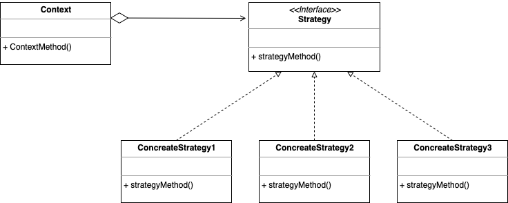
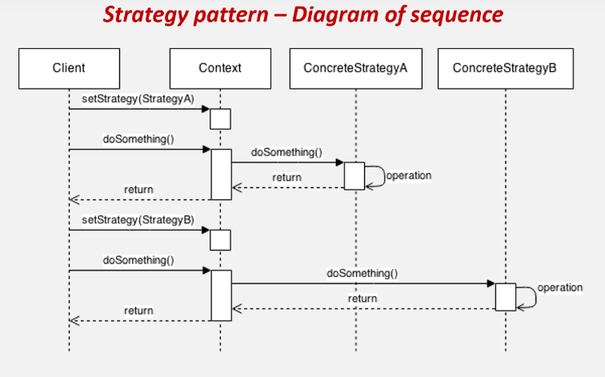

# Strategy Pattern(전략 패턴)
> 실행(런타임) 중에 알고리즘 전략을 선택하여 객체 동작을 실시간으로 바뀌도록 할 수 있게 하는 행위 디자인 패턴

## 개요
- '전략'이란 일종의 알고리즘이 될 수 있으며, 기능이나 동작이 될 수도 있는 특정한 목표를 수행하기 위한 행동 계획을 말한다.
- 즉, 어떤 일을 수행하는 알고리즘이 여러가지일 때, 동작들을 미리 전략으로 정의함으로써 손쉽게 전략을 교체할 수 있는, 알고리즘 변형이 빈번하게 필요한 경우에 적합한 패턴이다.

## 구조
<p align="center"></p>

1. 전략 패턴 객체들 : 알고리즘, 행위, 동작을 객체로 정의한 구현체 
2. 전략 인터페이스 : 모든 전략 구현제에 대한 공용 인터페이스  
3. 컨텍스트(Context) : 알고리즘을 실행해야 할 때마다 해당 알고리즘과 연결된 전략 객체의 메소드를 호출 
4. 클라이언트 : 특정 전략 객체를 컨텍스트에 전달함으로써 전략을 등록하거나 변경하여 전략 알고리즘을 실행한 결과를 누린다.

> 프로그래밍에서의 ​컨텍스트(Context)란 콘텐츠(Contetns)를 담는 그 무엇인가를 뜻하며, 어떤 객체를 핸들링 하기 위한 접근 수단이다.

## 정의
1️. 동일 계열의 알고리즘군을 정의
2. 각각의 알고리즘을 캡슐화하여 
3. 이들을 상호 교환이 가능하도록 만든다.
4. 알고리즘을 사용하는 클라이언트와 상관없이 독립적으로
5. 알고리즘을 다양하게 변경할 수 있게 한다. 

- SOLID 원칙의 OCP 원칙, DIP 원칙과 합성(compositoin), 다형성(polymorphism), 캡슐화(encapsulation) 등 OOP 기술들의 총집합 버전이다.
- 따라서 위의 전략 패턴의 정의를 다음과 같이 빗대어 설명할 수 있다.

1) 동일 계열의 알고리즘군을 정의하고 → 전략 구현체로 정의
2) 각각의 알고리즘을 캡슐화하여 → 인터페이스로 추상화
3) 이들을 상호 교환이 가능하도록 만든다. → 합성(composition)으로 구성
4) 알고리즘을 사용하는 클라이언트와 상관없이 독립적으로 → 컨텍스트 객체 수정 없이
5) 알고리즘을 다양하게 변경할 수 있게 한다. → 메소드를 통해 전략 객체를 실시간으로 변경함으로써 전략을 변경

## 흐름
<p align="center"></p>

```java
// 전략(추상화된 알고리즘)
interface IStrategy {
    void doSomething();
}

// 전략 알고리즘 A
class ConcreteStrateyA implements IStrategy {
    public void doSomething() {}
}

// 전략 알고리즘 B
class ConcreteStrateyB implements IStrategy {
    public void doSomething() {}
}
```

```java
// 컨텍스트(전략 등록/실행)
class Context {
    IStrategy Strategy; // 전략 인터페이스를 합성(composition)
	
    // 전략 교체 메소드
    void setStrategy(IStrategy Strategy) {
        this.Strategy = Strategy;
    }
	
    // 전략 실행 메소드
    void doSomething() {
        this.Strategy.doSomething();
    }
}
```

<p align="center"></p>

```java
// 클라이언트(전략 교체/전략 실행한 결과를 얻음)
class Client {
    public static void main(String[] args) {
        // 1. 컨텍스트 생성
        Context c = new Context();

        // 2. 전략 설정
        c.setStrategy(new ConcreteStrateyA());

        // 3. 전략 실행
        c.doSomething();

        // 4. 다른 전략 설정
        c.setStrategy(new ConcreteStrateyB());

        // 5. 다른 전략 시행
        c.doSomething();
    }
}
```

## 특징
### 사용 시기
- 전략 알고리즘의 여러 버전 또는 변형이 필요할 때 클래스화를 통해 관리
- 알고리즘 코드가 노출되어서는 안 되는 데이터에 액세스 하거나 데이터를 활용할 때 (캡슐화)
- 알고리즘의 동작이 런타임에 실시간으로 교체 되어야 할때

### 주의점
- 알고리즘이 많아질수록 관리해야 할 객체의 수가 늘어난다는 단점이 있다.
- 만일 어플리케이션 특성이 알고리즘이 많지 않고 자주 변경되지 않는다면, 새로운 클래스와 인터페이스를 만들어 프로그램을 복잡하게 만들 이유가 없다.
- 개발자는 적절한 전략을 선택하기 위해 전략 간의 차이점을 파악하고 있어야 한다. (복잡도 ↑)

## 예시
### RPG 게임

#### ❌ 클린하지 못한 코드
```java
class Weapon {
    public static final int SWORD = 0;
    public static final int SHIELD = 1;
    public static final int CROSSBOW = 2;

    private int state;

    void setWeapon(int state) {
        this.state = state;
    }

    void attack() {
        if (state == SWORD) {
            System.out.println("칼을 휘두르다");
        } else if (state == SHIELD) {
            System.out.println("방패로 밀친다");
        } else if (state == CROSSBOW) {
            System.out.println("석궁을 발사하다");
        }
    }
}
```

```java
class User {
    public static void main(String[] args) {
        // 플레이어 손에 무기 착용 전략을 설정
        Weapon hand = new Weapon();

        // 플레이어가 검을 들도록 전략 설정
        hand.setWeapon(Weapon.SWORD);
        hand.attack(); // "칼을 휘두르다"

        // 플레이어가 방패를 들도록 전략 설정
        hand.setWeapon(Weapon.SHIELD);
        hand.attack(); // "방패로 밀친다"
    }
}
```
- 코드를 살펴보면 state 매개변수의 값에 따라서 간접적으로 attack() 함수의 동작을 제어하도록 되어 있다. 상수를 메소드에 넘겨 조건문으로 일일히 필터링하여 적절한 전략을 실행한다.
- 하지만 상태 변수를 통해 행위를 분기문으로 나누는 행위는 좋지 않은 코드이다. 자칫 잘못하면 if else 지옥에 빠질 수 있기 때문이다.

#### ✅ 전략 패턴을 적용한 코드
- 위의 클린하지 않은 코드를 해결하는 가장 좋은 방법은 변경시키고자 하는 행위(전략)를 직접 넘겨주는 것이다.
- 우선 여러 무기들을 객체 구현체로 정의하고 이들을 Weapon이라는 인터페이스로 묶어준다.
- 그리고 인터페이스를 컨텍스트 클래스에 합성(composition)시키고, setWeapon() 메소드를 통해 전략 인터페이스 객체의 상태를 바로바로 변경할 수 있도록 구성한다.


