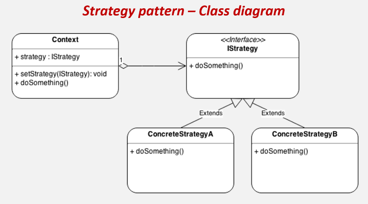

# Strategy Pattern(전략 패턴)
> 실행(런타임) 중에 알고리즘 전략을 선택하여 객체 동작을 실시간으로 바뀌도록 할 수 있게 하는 행위 디자인 패턴

## 개요
- '전략'이란 일종의 알고리즘이 될 수 있으며, 기능이나 동작이 될 수도 있는 특정한 목표를 수행하기 위한 행동 계획을 말한다.
- 즉, 어떤 일을 수행하는 알고리즘이 여러가지일 때, 동작들을 미리 전략으로 정의함으로써 손쉽게 전략을 교체할 수 있는, 알고리즘 변형이 빈번하게 필요한 경우에 적합한 패턴이다.

## 구조
<p align="center"></p>

1. 전략 패턴 객체들 : 알고리즘, 행위, 동작을 객체로 정의한 구현체 
2. 전략 인터페이스 : 모든 전략 구현제에 대한 공용 인터페이스  
3. 컨텍스트(Context) : 알고리즘을 실행해야 할 때마다 해당 알고리즘과 연결된 전략 객체의 메소드를 호출 
4. 클라이언트 : 특정 전략 객체를 컨텍스트에 전달함으로써 전략을 등록하거나 변경하여 전략 알고리즘을 실행한 결과를 누린다.

> 프로그래밍에서의 ​컨텍스트(Context)란 콘텐츠(Contetns)를 담는 그 무엇인가를 뜻하며, 어떤 객체를 핸들링 하기 위한 접근 수단이다.

## 정의
1️. 동일 계열의 알고리즘군을 정의
2. 각각의 알고리즘을 캡슐화하여 
3. 이들을 상호 교환이 가능하도록 만든다.
4. 알고리즘을 사용하는 클라이언트와 상관없이 독립적으로
5. 알고리즘을 다양하게 변경할 수 있게 한다. 

- SOLID 원칙의 OCP 원칙, DIP 원칙과 합성(compositoin), 다형성(polymorphism), 캡슐화(encapsulation) 등 OOP 기술들의 총집합 버전이다.
- 따라서 위의 전략 패턴의 정의를 다음과 같이 빗대어 설명할 수 있다.

1) 동일 계열의 알고리즘군을 정의하고 → 전략 구현체로 정의
2) 각각의 알고리즘을 캡슐화하여 → 인터페이스로 추상화
3) 이들을 상호 교환이 가능하도록 만든다. → 합성(composition)으로 구성
4) 알고리즘을 사용하는 클라이언트와 상관없이 독립적으로 → 컨텍스트 객체 수정 없이
5) 알고리즘을 다양하게 변경할 수 있게 한다. → 메소드를 통해 전략 객체를 실시간으로 변경함으로써 전략을 변경

## 흐름

### 클래스 구성
<p align="center"></p>

```java
// 전략(추상화된 알고리즘)
interface IStrategy {
    void doSomething();
}

// 전략 알고리즘 A
class ConcreteStrateyA implements IStrategy {
    public void doSomething() {}
}

// 전략 알고리즘 B
class ConcreteStrateyB implements IStrategy {
    public void doSomething() {}
}
```

```java
// 컨텍스트(전략 등록/실행)
class Context {
    IStrategy Strategy; // 전략 인터페이스를 합성(composition)
	
    // 전략 교체 메소드
    void setStrategy(IStrategy Strategy) {
        this.Strategy = Strategy;
    }
	
    // 전략 실행 메소드
    void doSomething() {
        this.Strategy.doSomething();
    }
}
```

### 클래스 흐름
<p align="center"></p>

```java
// 클라이언트(전략 교체/전략 실행한 결과를 얻음)
class Client {
    public static void main(String[] args) {
        // 1. 컨텍스트 생성
        Context c = new Context();

        // 2. 전략 설정
        c.setStrategy(new ConcreteStrateyA());

        // 3. 전략 실행
        c.doSomething();

        // 4. 다른 전략 설정
        c.setStrategy(new ConcreteStrateyB());

        // 5. 다른 전략 시행
        c.doSomething();
    }
}
```

## 특징
### 사용 시기
- 전략 알고리즘의 여러 버전 또는 변형이 필요할 때 클래스화를 통해 관리
- 알고리즘 코드가 노출되어서는 안 되는 데이터에 액세스 하거나 데이터를 활용할 때 (캡슐화)
- 알고리즘의 동작이 런타임에 실시간으로 교체 되어야 할때

### 주의점
- 알고리즘이 많아질수록 관리해야 할 객체의 수가 늘어난다는 단점이 있다.
- 만일 어플리케이션 특성이 알고리즘이 많지 않고 자주 변경되지 않는다면, 새로운 클래스와 인터페이스를 만들어 프로그램을 복잡하게 만들 이유가 없다.
- 개발자는 적절한 전략을 선택하기 위해 전략 간의 차이점을 파악하고 있어야 한다. (복잡도 ↑)

## 예시
### RPG 게임

#### ❌ 클린하지 못한 코드
```java
class Weapon {
    public static final int SWORD = 0;
    public static final int SHIELD = 1;
    public static final int CROSSBOW = 2;

    private int state;

    void setWeapon(int state) {
        this.state = state;
    }

    void attack() {
        if (state == SWORD) {
            System.out.println("칼을 휘두르다");
        } else if (state == SHIELD) {
            System.out.println("방패로 밀친다");
        } else if (state == CROSSBOW) {
            System.out.println("석궁을 발사하다");
        }
    }
}
```

```java
class User {
    public static void main(String[] args) {
        // 플레이어 손에 무기 착용 전략을 설정
        Weapon hand = new Weapon();

        // 플레이어가 검을 들도록 전략 설정
        hand.setWeapon(Weapon.SWORD);
        hand.attack(); // "칼을 휘두르다"

        // 플레이어가 방패를 들도록 전략 설정
        hand.setWeapon(Weapon.SHIELD);
        hand.attack(); // "방패로 밀친다"
    }
}
```
- 코드를 살펴보면 state 매개변수의 값에 따라서 간접적으로 attack() 함수의 동작을 제어하도록 되어 있다. 상수를 메소드에 넘겨 조건문으로 일일히 필터링하여 적절한 전략을 실행한다.
- 하지만 상태 변수를 통해 행위를 분기문으로 나누는 행위는 좋지 않은 코드이다. 자칫 잘못하면 if else 지옥에 빠질 수 있기 때문이다.

#### ✅ 전략 패턴을 적용한 코드
- 위의 클린하지 않은 코드를 해결하는 가장 좋은 방법은 변경시키고자 하는 행위(전략)를 직접 넘겨주는 것이다.
- 우선 여러 무기들을 객체 구현체로 정의하고 이들을 Weapon이라는 인터페이스로 묶어준다.
- 그리고 인터페이스를 컨텍스트 클래스에 합성(composition)시키고, setWeapon() 메소드를 통해 전략 인터페이스 객체의 상태를 바로바로 변경할 수 있도록 구성한다.

```java
// 전략 - 추상화된 알고리즘
interface Weapon {
    void offensive();
}

class Sword implements Weapon {
    @Override
    public void offensive() {
        System.out.println("칼을 휘두르다");
    }
}

class Shield implements Weapon {
    @Override
    public void offensive() {
        System.out.println("방패로 밀친다");
    }
}

class CrossBow implements Weapon {
    @Override
    public void offensive() {
        System.out.println("석궁을 발사하다");
    }
}
```
```java
// 컨텍스트 - 전략을 등록하고 실행
class TakeWeaponStrategy {
    Weapon wp;

    void setWeapon(Weapon wp) {
        this.wp = wp;
    }

    void attack() {
        wp.offensive();
    }
}
```
```java
// 클라이언트 - 전략 제공/설정
class User {
    public static void main(String[] args) {
        // 플레이어 손에 무기 착용 전략을 설정
        TakeWeaponStrategy hand = new TakeWeaponStrategy();

        // 플레이어가 검을 들도록 전략 설정
        hand.setWeapon(new Sword());
        hand.attack(); // "칼을 휘두르다"

        // 플레이어가 방패를 들도록 전략 변경
        hand.setWeapon(new Shield());
        hand.attack(); // "방패로 밀친다"
        
        // 플레이어가 석궁을 들도록 전략 변경
        hand.setWeapon(new Crossbow());
        hand.attack(); // "석궁을 발사하다"
    }
}
```

- 클린하지 않은 코드에서는 메서드에 상수값을 넘겨주었지만, 전략 패턴에선 인스턴스를 넣어 알고리즘을 수행하도록 한 것이다.
- 이런식으로 구성하면 좋은 점은 나중에 칼이나 방패 외에 도끼나 창과 같은 전략 무기들을 추가로 등록할때, 코드의 수정 없이 빠르게 기능을 확장할 수 있다는 장점이 있다. (클래스를 추가하고 implements 해준다.)
- 결국 객체 지향 프로그래밍의 핵심인 유지보수를 용이하게 하기 위해, 약간 복잡하더라도 이러한 패턴을 적용하여 프로그램을 구성해 나가는 것이다.

### 로봇 
#### ❌ 클린하지 못한 코드
```java
public abstract class Robot {
    public abstract void display();
    public abstract void move();
}

class WalkingRobot extends Robot {
    public void display() {
        System.out.println("걷기 로봇");
    }
    public void move() {
        System.out.println("걸어서 배달합니다 삐-빅");
    }
}

class RunningRobot extends Robot {
    public void display() {
        System.out.println("달리는 로봇");
    }
    public void move() {
        System.out.println("뛰어서 배달합니다 삐-빅");
    }
}

class Main {
    public static void main(String[] args) {
        Robot robot1 = new WalkingRobot();
        robot1.display();
        robot1.move();

        Robot robot2 = new RunningRobot();
        robot2.display();
        robot2.move();
    }
}
```
- 보기에는 객체 지향적인 문제 없는 코드이지만, 만일 고객으로부터 로봇의 기능 추가를 요청받았을 때 코드의 유지 보수 면에서 문제가 발생한다.
- 예를 들어 로봇에 번역 기능도 추가한다고 가정한다면 translate() 메서드를 걷는 로봇(WalingRobot), 뛰는 로봇(RunningRobot)에 추가하여야 한다.
- 그래서 추상화 구조에 맞게 Robot 추상 클래스에 메서드를 추가하고 각각 기능을 알맞게 하는 로봇 클래스를 분리하여 구현하니 자식 로봇 클래스가 두배로 늘어나 버린다. 
- 여기서 또 기능을 추가하면 이번엔 클래스가 8개로 불어날 것이다. 그 뿐만 아니라 어느 하나의 기능 move() 메서드 스펙을 변경해야 된다면 전체 자식 클래스에 등록 되어있는 move() 메서드를 일일히 뒤져 수정해야 할 것이다.

```java
public abstract class Robot {
    public abstract void display();
    public abstract void move();
    public abstract void translate(); // 번역 메소드 하나를 추가했을 뿐인데
}

// --- 클래스 갯수가 두배로 늘어나 버렸다 !!

class KoreanWalkingRobot extends Robot {
    public void display() {
        System.out.println("걷기 로봇");
    }
    public void move() {
        System.out.println("걸어서 배달합니다 삐-빅");
    }
    public void translate() {
        System.out.println("한국어로 번역합니다 삐-비-빅");
    }
}

class KoreanRunningRobot extends Robot {
    public void display() {
        System.out.println("달리는 로봇");
    }
    public void move() {
        System.out.println("뛰어서 배달합니다 삐-빅");
    }
    public void translate() {
        System.out.println("한국어로 번역합니다 삐-비-빅");
    }
}

class JapaneseWalkingRobot extends Robot {
    public void display() {
        System.out.println("걷기 로봇");
    }
    public void move() {
        System.out.println("걸어서 배달합니다 삐-빅");
    }
    public void translate() {
        System.out.println("일본어로 번역합니다 삐-비-빅");
    }
}

class JapaneseRunningRobot extends Robot {
    public void display() {
        System.out.println("달리는 로봇");
    }
    public void move() {
        System.out.println("뛰어서 배달합니다 삐-빅");
    }
    public void translate() {
        System.out.println("일본어로 번역합니다 삐-비-빅");
    }
}
```

#### ✅ 전략 패턴을 적용한 코드
- 위와 같은 '클래스 폭발' 문제가 일어난 이유는 객체를 사물 / 생물 정도로 밖에 인식하지 못해서이다.
- 객체는 하나의 기능이나 행위, 동작으로도 표현할 수 있다. 전략 패턴은 이러한 접근으로 복잡한 문제를 해결해 나가는 식이다.
- 예를 들어 로봇 클래스가 있고 서빙하는 동작 메소드가 있다면, 이 서빙 메소드를 로봇 사물 객체에 국한되게 하는게 아니라, 따로 행위 구현체로 빼서 정의하고 관리하는 것이다.
- 그리고 이 행위 객체들을 모아 인터페이스로 묶어 하나의 전략 묶음을 구성하고, 이것을 컨텍스트에 합성시켜 다형성을 통해 유기적으로 여러 전략 행위들을 사용할 수 잇도록 하는 것이다.
- 그래서 만들고자 하는 사물인 로봇 클래스는 하나이고, 로봇에 서로 다른 다양한 전략 객체들을 적용시킴으로써 각기 다른 전략을 수행하는 로봇들을 여러 개 만들거나 혹은 하나의 로봇을 가지고 여러 가지 전략을 스위칭하여 실행할 수 있게 한다.

```java
// Run / Walk 전략(추상화된 알고리즘)
interface MoveStrategy {
    void move();
}

class Walk implements MoveStrategy {
    public void move() {
        System.out.println("걸어서 배달합니다 삐-빅");
    }
}

class Run implements MoveStrategy {
    public void move() {
        System.out.println("뛰러서 배달합니다 삐-빅");
    }
}

// 한국어 / 일본어 번역 전략(추상화된 알고리즘)
interface TranslateStrategy {
    void translate();
}

class Korean implements TranslateStrategy {
    public void translate() {
        System.out.println("한국어로 번역합니다 삐-비-빅");
    }
}

class Japanese implements TranslateStrategy {
    public void translate() {
        System.out.println("일본어로 번역합니다 삐-비-빅");
    }
}
```
```java
// 컨텍스트(전략 등록/실행)
public class Robot {
    MoveStrategy moveStrategy;
    TranslateStrategy translateStrategy;

    Robot(MoveStrategy moveStrategy, TranslateStrategy translateStrategy) {
        this.moveStrategy = moveStrategy;
        this.translateStrategy = translateStrategy;
    }

    void move() {
        moveStrategy.move();
    }

    void translate() {
        translateStrategy.translate();
    }

    void setMove(MoveStrategy moveStrategy) {
        this.moveStrategy = moveStrategy;
    }

    void setTranslate(TranslateStrategy translateStrategy) {
        this.translateStrategy = translateStrategy;
    }
}
```
```java
// 클라이언트(전략 교체/전략 실행한 결과를 얻음)
class User {
    public static void main(String[] args) {
        Robot robot = new Robot(new Walk(), new Korean());
        robot.move(); // 걸어서 배달합니다 삐-빅
        robot.translate(); // 한국어로 번역합니다 삐-비-빅

        // 로봇의 전략(기능)을 run과 Japanese 번역으로 변경
        robot.setMove(new Run());
        robot.setTranslate(new Japanese());

        robot.move(); // 뛰어서 배달합니다 삐-빅
        robot.translate(); // 일본어로 번역합니다 삐-비-빅
    }
}
```

## Strategy 패턴의 실사용
### Java
- Collections의 sort() 메서드에 의해 구현되는 compare() 메서드에 이용
- javax.servlet.http.HttpServlet에서 service() 메서드와 모든 doXXX() 메서드에 이용
- javax.servlet.Filter의 doFilter() 메서드에 이용

#### Comparator
- 사실 자바에서 익명 클래스로 구현체를 그때그때 정의하고 안의 동작 메소드의 로직을 그때그때 만들어 할당하는 방식도 일종의 전략을 실시간으로 변경하여 지정하는 패턴과 많이 유사하다고 볼 수 있다.

### Spring Framework

```java
public class StrategyInSpring {
    public static void main(String[] args) {
    	// 각각의 설정에 따라 나눠진 ApplicationContext 들
        ApplicationContext applicationContext = new ClassPathXmlApplicationContext();
        ApplicationContext applicationContext1 = new FileSystemXmlApplicationContext();
        ApplicationContext applicationContext2 = new AnnotationConfigApplicationContext();

        BeanDefinitionParser parser;
        
        PlatformTransactionManager platformTransactionManager; // 다양한 트랜잭션 메니저를 제공한다

        CacheManager cacheManager; // 다양한 캐시 전략을 제공 
    }
}
```

## Strategy vs Template Method
### 유사점
1. 전략 패턴과 템플릿 메서드 패턴은 알고리즘을 때에 따라 적용한다는 컨셉으로써, 둘이 공통점을 가지고 있다.
2. 전략 및 템플릿 메서드 패턴은 개방형 폐쇄 원칙을 충족하고 코드를 변경하지 않고 소프트웨어 모듈을 쉽게 확장할 수 있도록 하는 데 사용할 수 있다. 
### 차이점
1. 전략 패턴은 합성(composition)을 통해 해결책을 강구하며, 템플릿 메서드 패턴은 상속(inheritance)을 통해 해결책을 제시한다.
2. 그래서 전략 패턴은 클라이언트와 객체 간의 결합이 느슨한 반면, 템플릿 메서드 패턴에서는 두 모듈이 더 밀접하게 결합된다. (결합도가 높으면 안좋음)
3. 전략 패턴에서는 대부분 인터페이스를 사용하지만, 템플릿 메서드 패턴서는 주로 추상 클래스나 구체적인 클래스를 사용한다.
4. 전략 패턴에서는 전체 전략 알고리즘을 변경할 수 있지만, 템플릿 메서드 패턴에서는 알고리즘의 일부만 변경되고 나머지는 변경되지 않은 상태로 유지된다. (템플릿에 종속)
5. 따라서 단일 상속만이 가능한 자바에서 상속 제한이 있는 템플릿 메서드 패턴보다는, 다양하게 많은 전략을 implements 할 수 있는 전략 패턴이 협업에서 많이 사용되는 편이다.


