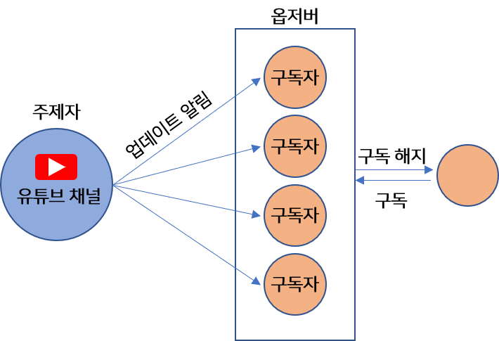
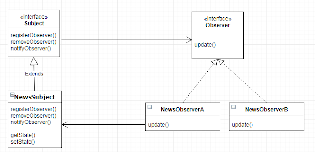

# Observer Pattern (옵저버 패턴)

## 정의
- 옵저버 패턴(Observer Pattern)은 옵저버(관찰자)들이 관찰하고 있는 대상자의 상태가 변화가 있을 때마다 대상자는 직접 목록의 각 관찰자들에게 통지하고, 관찰자들은 알림을 받아 조치를 취하는 행동 패턴이다.
- 옵저버 패턴은 여타 다른 디자인 패턴들과 다르게 일대다(one-to-many) 의존성을 가지는데, 주로 분산 이벤트 핸들링 시스템을 구현하는 데 사용된다. Pub/Sub(발행/구독) 모델로도 알려져 있기도 하다.
- 이 패턴을 이해하는데 있어 뉴스 피드나 유튜브로 비유해보면 쉽다. 유튜브 채널은 발행자(Subject)가 되고 구독자들은 관찰자(Observer)가 되는 구조로 보면 된다.
- 실제로 유튜버가 영상을 올리면 여러 명의 구독자들은 모두 영상이 올라왔다는 알림을 받는데, 이를 패턴 구조로 보자면 구독자들은 해당 채널을 구독함으로써 채널에 어떠한 변화(영상을 올리거나 커뮤니티에 글을 쓰거나)가 생기게 되면 바로 연락을 받아 탐지하는 것이다. 반면 구독을 해지하거나 안한 시청자에게는 알림이 가지 않게 된다.

<p align="center"></p>

## 구조

<p align="center"></p>

- ℹ️ ISubject : 관찰 대상자를 정의하는 인터페이스
- ℹ️ ConcreteSubject : 관찰 당하는 대상자 / 발행자 / 게시자
  - ✅ Observer들을 리스트(List, Map, Set ..등)로 모아 합성(compositoin)하여 가지고 있음
  - ✅ Subject의 역할은 관찰자인 Observer들을 내부 리스트에 등록/삭제 하는 인프라를 갖고 있다. (register, remove)
  - ✅ Subject가 상태를 변경하거나 어떤 동작을 실행할때, Observer 들에게 이벤트 알림(notify)을 발행한다.
- ℹ️ IObserver : 구독자들을 묶는 인터페이스 (다형성)
- ℹ️ Observer : 관찰자 / 구독자 / 알림 수신자.
  - ✅ Observer들은 Subject가 발행한 알림에 대해 현재 상태를 취득한다.
  - ✅ Subject의 업데이트에 대해 전후 정보를 처리한다.

- 옵저버 패턴은 여타 다른 디자인 패턴과 똑같이 상호작용할 객체를 합성(compositoin)을 하고 메서드 위임을 통해 구성하는 코드 패턴임은 똑같다.
- 핵심은 합성한 객체를 리스트로 관리하고 리스트에 있는 관찰자 객체들에게 모두 메서드 위임을 통한 전파 행위를 한다는 점이다.


## 흐름
1. 옵저버 패턴에서는 한 개의 관찰 대상자(Subject)와 여러 개의 관찰자(Observer A, B, C)로 일대다 관계로 구성되어 있다.
2. Observer 패턴에서는 관찰 대상 Subject의 상태가 바뀌면 변경 사항을 옵저버한테 통보한다. (notifyObserver)
3. 대상자로부터 통보를 받은 Observer는 값을 바꾸거나 삭제하는 등 적절히 대응한다. (update)
4. 또한 Observer들은 언제든 Subject의 그룹에서 추가/삭제될 수 있다. Subject 그룹에 추가되면 Subject로부터 정보를 전달받게 되며, 그룹에서 삭제되면 더 이상 Subject의 정보를 받을 수 없게 된다.

### 클래스 구조
```java
// 관찰 대상자 / 발행자
interface ISubject {
    void registerObserver(IObserver o);
    void removeObserver(IObserver o);
    void notifyObserver();
}

class ConcreteSubject implements ISubject {
    // 관찰자들을 등록하여 담는 리스트
    List<IObserver> observers = new ArrayList<>();

    // 관찰자를 리스트에 등록
    @Override
    public void registerObserver(IObserver o) {
        observers.add(o);
        System.out.println(o + " 구독 완료");
    }

    // 관찰자를 리스트에 제거
    @Override
    public void removeObserver(IObserver o) {
        observers.remove(o);
        System.out.println(o + " 구독 취소");
    }

    // 관찰자에게 이벤트 송신
    @Override
    public void notifyObserver() {
        for(IObserver o : observers) { // 관찰자 리스트를 순회하며
            o.update(); // 위임
        }
    }
}
```
```java
// 관찰자 / 구독자
interface IObserver {
    void update();
}

class ObserverA implements IObserver {
    public void update() {
        System.out.println("ObserverA 한테 이벤트 알림이 왔습니다.");
    }

    public String toString() { return "ObserverA"; }
}

class ObserverB implements IObserver {
    public void update() {
        System.out.println("ObserverB 한테 이벤트 알림이 왔습니다.");
    }

    public String toString() { return "ObserverB"; }
}
```

### 클래스 흐름
```java
public class Client {
    public static void main(String[] args) {

        // 발행자 등록
        ISubject publisher = new ConcreteSubject();

        // 발행자를 구독할 관찰자들 리스트로 등록
        IObserver o1 = new ObserverA();
        IObserver o2 = new ObserverB();
        publisher.registerObserver(o1);
        publisher.registerObserver(o2);

        // 관찰자에게 이벤트 전파
        publisher.notifyObserver();

        // ObserverB가 구독 취소
        publisher.removeObserver(o2);

        // ObserverA 한테만 이벤트 전파
        publisher.notifyObserver();
    }
}
```

## 특징
### 사용 시점
- 앱이 한정된 시간, 특정한 케이스에만 다른 객체를 관찰해야 하는 경우
- 대상 객체의 상태가 변경될 때마다 다른 객체의 동작을 트리거해야 할때
- 한 객체의 상태가 변경되면 다른 객체도 변경해야 할때. 그런데 어떤 객체들이 변경되어야 하는지 몰라도 될 때
- MVC 패턴에서도 사용됨 (Model, View, Controller)
  - MVC의 Model과 View의 관계는 Observer 패턴의 Subject 역할과 Observer 역할의 관계에 대응된다.  
  - 하나의 Model에 복수의 View가 대응한다.

### 장점
- Subject의 상태 변경을 주기적으로 조회하지 않고 자동으로 감지할 수 있다.
- 발행자의 코드를 변경하지 않고도 새 구독자 클래스를 도입할 수 있어 개방 폐쇄 원칙(OCP)을 준수한다
- 런타임 시점에서 발행자와 구독 알림 관계를 맺을 수 있다.
- 상태를 변경하는 객체(Subject)와 변경을 감지하는 객체(Observer)의 관계를 느슨하게 유지할 수 있다. (느슨한 결합)

### 단점
- 구독자는 알림 순서를 제어할수 없고, 무작위 순서로 알림을 받음
  - 하드 코딩으로 구현할 수는 있겠지만, 복잡성과 결합성만 높아지기 때문에 추천되지는 않는 방법이다.
- 옵저버 패턴을 자주 구성하면 구조와 동작을 알아보기 힘들어져 코드 복잡도가 증가한다.
- 다수의 옵저버 객체를 등록 이후 해지하지 않는다면 메모리 누수가 발생할 수도 있다.


## 예시
### 날씨 api로부터 온습도 알림 받기
- 현재 날씨의 온도, 습도, 기압 데이터를 얻을수 있는 서비스인 WeatherAPI 클래스가 있다고 하자.
- 각 국가의 사용자들이 이 날씨 API를 이용해 온습도 데이터를 가져와 display 한다는 서비스를 개발하려고 한다.

#### ❌ 클린하지 않은 문제의 코드 
```java
class WeatherAPI {
    float temp; // 온도
    float humidity; // 습도
    float pressure; // 기압

    void measurementsChanged() {
        // 현재의 온습도 데이터를 랜덤값으로 얻는 것으로 비유하였다.
        temp = new Random().nextFloat() * 100;
        humidity = new Random().nextFloat() * 100;
        pressure = new Random().nextFloat() * 100;
    }
}
```
```java
interface IUser {
	void display();
}

class KoreanUser implements IUser {
    WeatherAPI api; // api서비스 객체를 합성함
    String name;

    KoreanUser(String name, WeatherAPI api) {
        this.name = name;
        this.api = api;
    }

    public void display() {
        System.out.printf("%s님이 현재 날씨 상태를 조회함 : %.2f°C %.2fg/m3 %.2fhPa\n", name, api.temp, api.humidity, api.pressure);
    }
}
```
```java
public class Client {
    public static void main(String[] args) {
        WeatherAPI api = new WeatherAPI();

        List<IUser> users = new ArrayList<>();
        users.add(new KoreanUser("홍길동", api));
        users.add(new KoreanUser("임꺽정", api));
        users.add(new KoreanUser("세종대왕", api));

        // 온습도기에서 현재 상태의 온습도 정보가 갱신됨
        api.measurementsChanged();

        for(IUser u: users) {
            u.display();
        }

        api.measurementsChanged();

        // ...
    }
}
```
- 당장 동작에 있어서 문제가 없어보이지만, Client 클래스에 코드가 너무 집약적으로 구성되어 있음을 볼 수 있다.
- 날씨 API를 신청한 유저들을 관리하는 프로세스를 클라이언트에서 관리하고 있으며, 유저들은 날씨 데이터가 갱신될 때(measurementsChanged) 데이터를 전달 받아 display 하는 것이 아닌 유저 클래스 내에 있는 api 객체에 자신이 직접 조회하여 display 하는 것이기 때문이다.

#### ✔️ 옵저버 패턴을 적용한 코드 
- 따라서 날씨 API를 신청한 유저들을 관리하는 프로세스를 클라이언트가 아닌 날씨 API 클래스에서 관리하도록 설정하고, 각 유저들이 변화된 날씨 데이터를 자동으로 전달받을 수 있도록 일종의 전파 및 동작 행위를 날씨 API 클래스에서 구현할 필요성이 있다. 
- 즉, WeatherAPI 클래스를 발행자, 관찰 대상자로서 Subject 인터페이스를 구현하도록 하고, API 사용자들을 관찰자, 구독자로서 Observer 인터페이스를 구현하도록 구성한다.

```java
interface Subject {
    void registerObserver(Observer o); // 구독 추가
    void removeObserver(Observer o); // 구독 삭제
    void notifyObservers(); // Subject 객체의 상태 변경시 이를 모든 옵저버에게 알flsek
}

class WeatherAPI implements Subject{
    float temp; // 온도
    float humidity; // 습도
    float pressure; // 기압

    // 구독자들을 담아 관리하는 리스트
    List<Observer> subscribers = new ArrayList<>();

    void measurementsChanged() {
        // 현재의 온습도 데이터를 랜덤값으로 얻는 것으로 비유하였다.
        temp = new Random().nextFloat() * 100;
        humidity = new Random().nextFloat() * 100;
        pressure = new Random().nextFloat() * 100;

        notifyObservers(); // 온습도 값이 변화하면 바로 옵저버들에게 발행
    }

    @Override
    public void registerObserver(Observer o) {
        subscribers.add(o);
    }

    @Override
    public void removeObserver(Observer o) {
        subscribers.remove(o);
    }

    // 이벤트 전파
    @Override
    public void notifyObservers() {
        for(Observer o: subscribers) {
            o.display(this); // 자신의 객체를 매개변수로 줘서 현재 자신의 상태를 구독자에게 알림
        }
    }
}
```
```java
interface Observer {
    void display(WeatherAPI api);
}

class KoreanUser implements Observer {
    String name;

    KoreanUser(String name) {
        this.name = name;
    }

    public void display(WeatherAPI api) {
        System.out.printf("%s님이 현재 날씨 상태를 조회함 : %.2f°C %.2fg/m3 %.2fhPa\n", name, api.temp, api.humidity, api.pressure);
    }
}
```
```java
public class Client {
    public static void main(String[] args) {
        WeatherAPI api = new WeatherAPI();

        api.registerObserver(new KoreanUser("홍길동"));
        api.registerObserver(new KoreanUser("임꺽정"));
        api.registerObserver(new KoreanUser("세종대왕"));

        // 온습도기에서 현재 상태의 온습도 정보가 갱신됨
        api.measurementsChanged();

        // 알아서 전파되어 출력

        api.measurementsChanged();

        // ...
    }
}
```

- 클라이언트에서 별다른 명령 없이 알아서 자동으로 발행자로부터 구독자들이 데이터를 전달받아 적절히 자동으로 처리하는 것을 볼 수 있다.
- 핵심은 구독자들의 관리를 발행자 객체에서 리스트로 한다는 점과 리스트에 있는 모든 구독자들의 메서드를 위임하여 실행함으로써 변화가 있을 때마다 이벤트성 알림으로 전파한다는 컨셉으로써 옵저버 패턴을 이해하면 된다.


## Observer 패턴의 실사용
### 자바의 내장 옵저버 객체
- java.util.Observable(인터페이스), java.util.Observer(클래스)로 내장 옵저버 객체를 지원한다. 이 내장 객체를 이용하면 옵저버 패턴을 직접 구현할 필요 없이 간단히 해당 클래스를 상속하기만 하면 옵저버 구조를 이용할 수가 있다.

#### java.util.Observer
- Observer 인터페이스를 implements한 클래스는 옵저버 클래스가 되게 된다. 옵저버 클래스들은 update() 추상 메서드를 구현함으로써, Observable 클래스로부터 데이터를 수신받게 된다.
- update(Observable o, Object arg) : Observable에게 전달받은 새로운 데이터를 갱신한다.

#### java.util.Observable
- Observable 클래스는 등록된 옵저버들을 관리하며, 새로운 데이터가 들어오면 옵저버에게 데이터를 전달하는 발행자 역할을 한다. 아래 클래스 구현부를 보면 Vector 컬렉션을 통해 옵저버들을 관리하는걸 볼 수 있다.
- 또한 Observable의 가장 큰 특징으로는 동기화(Synchronized)가 걸려있어 Thread-Safe 하다는 것이다. 이 Observable 클래스를 상속(extends)한 클래스는 발행자 역할로서 수행하게 된다.


```java
public class Observable {
    private boolean changed = false;
    private Vector<Observer> obs = new Vector();

    public Observable() {
    }

    public synchronized void addObserver(Observer o) {
        if (o == null) {
            throw new NullPointerException();
        } else {
            if (!this.obs.contains(o)) {
                this.obs.addElement(o);
            }

        }
    }

    public synchronized void deleteObserver(Observer o) {
        this.obs.removeElement(o);
    }

    public void notifyObservers() {
        this.notifyObservers((Object)null);
    }

    public void notifyObservers(Object arg) {
        Object[] arrLocal;
        synchronized(this) {
            if (!this.changed) {
                return;
            }

            arrLocal = this.obs.toArray();
            this.clearChanged();
        }

        for(int i = arrLocal.length - 1; i >= 0; --i) {
            ((Observer)arrLocal[i]).update(this, arg);
        }

    }

    public synchronized void deleteObservers() {
        this.obs.removeAllElements();
    }

    protected synchronized void setChanged() {
        this.changed = true;
    }

    protected synchronized void clearChanged() {
        this.changed = false;
    }

    public synchronized boolean hasChanged() {
        return this.changed;
    }

    public synchronized int countObservers() {
        return this.obs.size();
    }
}
```
- addObserver(Observer o) : 옵저버를 리스트에 추가
- notifyObservers(): 새로운 데이터가 들어오면 등록된 옵저버에 새로운 데이터와, 파라미터를 전달
- deleteObservers() : 등록된 모든 옵저버를 제거
- setChanged() : 신규 데이터가 들어오면 changed 값을 true로 변경. (changed 변수가 true 일때만 데이터가 옵저버에 전달된다)
- clearChanged() : changed 값을 false 로 변경한다. 옵저버에게 발행을 멈춘다
- hasChanged() : 현재 changed의 값을 반환
- countObservers() : 현재 등록되어있는 옵저버의 수를 반환


### 내장 옵저버 객체의 한계

- 옵저버 패턴은 실무에서 많이 사용하고 유용한 패턴이니 자바에서 따로 내장 객체로 지원한다. 그럼 옵저버 패턴을 구현할 일이 있다면 내장 옵저버 객체를 사용하면 되겠다고 생각할 수도 있지만 치명적인 한계점이 존재한다.
- 왜냐하면 java.util.Observable은 클래스이기 때문에 상속을 해야 된다는 점인데, 자바에서는 단일 상속만 지원하기 때문에 만일 발행자 역할을 해야 하는 클래스가 다른 클래스를 상속하고 있는 상태라면 java.util.Observable 클래스의 하위 클래스로 할 수 없게 되기 때문이다.
- 그럼 합성(composition)을 통해 메서드 위임으로 구성해주면 되지 않을까 싶지만, Observable 클래스를 살펴보면 setChanged() 메소드가 protected로 선언되어 있다. 즉, Observable의 자식 클래스에서만 호출할 수 있다는 것이다. 
- 따라서 근본적인 해결책은 결국 디자인 패턴으로서 옵저버 패턴을 개발자가 직접 구현해야 한다는 점이다. 지금까지 우리가 옵저버 패턴을 연습한 보람이 있는 것이다.

## 이외의 사용처
- java.util.Observer / java.util.Observable 
- java.util.EventListener의 모든 구현체
- javax.servlet.http.HttpSessionBindingListener
- javax.servlet.http.HttpSessionAttributeListener
- javax.faces.event.PhaseListener

