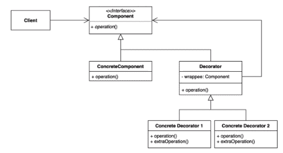

# Decorator Pattern (데코레이터 패턴)

## 정의
- 데코레이터 패턴(Decorator Pattern)은 대상 객체에 대한 기능 확장이나 변경이 필요할때 객체의 결합을 통해 서브클래싱 대신 쓸 수 있는 유연한 대안 구조 패턴이다.
- 마치 기본 제품에 포장지나 외부 디자인을 살짝 변경해 줌으로써 새로운 기능을 부여하는 것과 같이, 객체 지향 프로그래밍에서 원본 객체에 대해서 무언가를 장식하여 더 멋진 기능을 가지게 만드는 것이기 때문에 이 명칭이 붙었다고 볼 수 있다.
- 데코레이터 패턴을 이용하면 필요한 추가 기능의 조합을 런타임에서 동적으로 생성할 수 있다.
- 데코레이트할 대상 객체를 새로운 행동들을 포함한 특수 장식자 객체에 넣어서 행동들을 해당 장식자 객체마다 연결시켜, 서브클래스로 구성할때 보다 훨씬 유연하게 기능을 확장 할 수 있다. 또한 기능을 구현하는 클래스들을 분리함으로써 수정이 용이해진다.

## 구조
<p align="center"></p>

- Component(Interface) : 원본 객체와 장식된 객체 모두를 묶는 역할
- ConcreteComponent : 원본 객체 (데코레이팅 할 객체)
- Decorator : 추상화된 장식자 클래스
  - 원본 객체를 합성(composition)한 wrappee 필드와 인터페이스의 구현 메소드를 가지고 있다
- ConcreteDecorator : 구체적인 장식자 클래스
  - 부모 클래스가 감싸고 있는 하나의 Component를 호출하면서 호출 전/후로 부가적인 로직을 추가할 수 있다.

## 흐름
### 클래스 구조
```java
// 원본 객체와 장식된 객체 모두를 묶는 인터페이스
interface IComponent {
    void operation();
}

// 장식될 원본 객체
class ConcreteComponent implements IComponent {
    public void operation() {
    }
}

// 장식자 추상 클래스
abstract class Decorator implements IComponent {
    IComponent wrappee; // 원본 객체를 composition

    Decorator(IComponent component) {
        this.wrappee = component;
    }

    public void operation() {
        wrappee.operation(); // 위임
    }
}

// 장식자 클래스
class ComponentDecorator1 extends Decorator {

    ComponentDecorator1(IComponent component) {
        super(component);
    }

    public void operation() {
        super.operation(); // 원본 객체를 상위 클래스의 위임을 통해 실행하고
        extraOperation(); // 장식 클래스만의 메소드를 실행한다.
    }

    void extraOperation() {
    }
}

class ComponentDecorator2 extends Decorator {

    ComponentDecorator2(IComponent component) {
        super(component);
    }

    public void operation() {
        super.operation(); // 원본 객체를 상위 클래스의 위임을 통해 실행하고
        extraOperation(); // 장식 클래스만의 메소드를 실행한다.
    }

    void extraOperation() {
    }
}
```

### 클래스 흐름
```java
public class Client {
    public static void main(String[] args) {
        // 1. 원본 객체 생성
        IComponent obj = new ConcreteComponent();

        // 2. 장식 1 하기
        IComponent deco1 = new ComponentDecorator1(obj);
        deco1.operation(); // 장식된 객체의 장식된 기능 실행

        // 3. 장식 2 하기
        IComponent deco2 = new ComponentDecorator2(obj);
        deco2.operation(); // 장식된 객체의 장식된 기능 실행

        // 4. 장식 1 + 2 하기
        IComponent deco3 = new ComponentDecorator1(new ComponentDecorator2(obj));
    }
}
```
- 데코레이터 된 객체는 메서드를 호출할때 장식한 메서드를 호출하여 반환 로직에 추가적으로 더 덧붙여서 결과값을 반환할 수 있다.

## 특징
### 사용 시점
- 객체 책임과 행동이 동적으로 상황에 따라 다양한 기능이 빈번하게 추가/삭제되는 경우
- 객체의 결합을 통해 기능이 생성될 수 있는 경우
- 객체를 사용하는 코드를 손상시키지 않고 런타임에 객체에 추가 동작을 할당해야 하는 경우
- 상속을 통해 서브클래싱으로 객체의 동작을 확장하는 것이 어색하거나 불가능할 때

### 장점
- 데코레이터를 사용하면 서브클래스를 만들때보다 훨씬 더 유연하게 기능을 확장할 수 있다.
- 객체를 여러 데코레이터로 래핑하여 여러 동작을 결합할 수 있다.
- 컴파일 타임이 아닌 런타임에 동적으로 기능을 변경할 수 있다.
- 각 장식자 클래스마다 고유의 책임을 가져 단일 책임 원칙(SRP)을 준수
- 클라이언트 코드 수정없이 기능 확장이 필요하면 장식자 클래스를 추가하면 되니 개방 폐쇄 원칙(OCP)을 준수
- 구현체가 아닌 인터페이스를 바라봄으로써 의존 역전 원칙(DIP) 준수

### 단점
- 만일 장식자 일부를 제거하고 싶다면, Wrapper 스택에서 특정 wrapper를 제거하는 것은 어렵다.
- 데코레이터를 조합하는 초기 생성코드가 보기 안좋을 수 있다. new A(new B(new C(new D())))
- 어느 장식자를 먼저 데코레이팅 하느냐에 따라 데코레이터 스택 순서가 결정지게 되는데, 만일 순서에 의존하지 않는 방식으로 데코레이터를 구현하기는 어렵다.

## 예시
### 특정 클래스 동기화 처리
```java
class MyData {
    private int data;

    public void setData(int data) {
        this.data = data;
    }

    public int getData() {
        return data;
    }
}
```

#### ❌ 클린하지 않은 문제의 코드
- 가장 심플한 솔루션은 MyData 클래스를 상속하여 메서드를 오버라이딩하여 synchronized 처리하는 로직으로 재정의하는 것이다.
```java
class SynchronizedData extends MyData {
	private int data;
    
    public void setData(int data) {
        synchronized (this) {
            this.data = data;
        }
    }

    public int getData() {
        synchronized (this) {
            return data;
        }
    }
}
```
```java
public class Client {
    public static void main(String[] args) {
        SynchronizedData data = new SynchronizedData();
        data.setData(1);
        System.out.println(data.getData());
    }
}
```
- 코드 동작 자체는 문제는 없다. 그러나 위에서도 경험했듯, 만일 동기화 처리 외에 다른 부가 처리 기능도 계속 요구사항이 들어온다면 서브 클래스 폭발이 일어나게 된다.
- 게다가 원본 MyData의 data 필드 변수가 private으로 설계되었기 때문에 상속으로 재사용이 불가능하여 서브 클래스에 또 변수를 선언하여 사용하였다.
- 결국 구성이 뒤죽박죽 된 느낌이 든다.

#### ✔️ 데코레이터 패턴을 적용한 코드

```java
// 원본 객체와 장식된 객체 모두를 묶는 인터페이스
interface IData{
    void setData(int data);
    int getData();
}
```
```java
// 장식될 원본 객체
class MyData implements IData{
    private int data;

    public void setData(int data) {
        this.data = data;
    }

    public int getData() {
        return data;
    }
}
```
```java
// 장식자 추상 클래스
abstract class MyDataDecorator implements IData {
    private IData mydataObj; // 최상위 인터페이스 타입으로 장식할 원본 객체 선언

    MyDataDecorator(IData mydataObj) {
        this.mydataObj = mydataObj;
    }

    public void setData(int data) {
        this.mydataObj.setData(data);
    }

    public int getData() {
        return mydataObj.getData();
    }
}
```
```java
// 장식자 클래스
class SynchronizedDecorator extends MyDataDecorator {

    SynchronizedDecorator(IData mydataObj) {
        super(mydataObj);
    }

    public void setData(int data) {
        synchronized (this) {
            System.out.println("동기화된 data 처리를 시작합니다.");
            super.setData(data); // 부모 메서드를 호출함으로써 자신을 감싸고 있는 장식자의 메서드를 호출
            System.out.println("동기화된 data를 처리를 완료하였 습니다.");
        }
    }

    public int getData() {
        synchronized (this) {
            System.out.println("동기화된 data 처리를 시작합니다.");
            int result = super.getData(); 
            System.out.println("동기화된 data를 처리를 완료하였 습니다.");
            return result;
        }
    }
}

// 나중에 기능 추가 요구사항이 와도 코드 수정없이 유연하게 클래스를 정의만 해주면 된다.
class AnotherSkillDecorator extends MyDataDecorator {
    private IData mydataObj;

    AnotherSkillDecorator(IData mydataObj) {
        super(mydataObj);
    }

    // ...
}
```
```java
public class Client {
    public static void main(String[] args) {
    
    	// 동시성이 필요없을 때
        IData data = new MyData(); 
        
    	// 동시성이 필요할 때
        IData dataSync = new SynchronizedDecorator(data);
        dataSync.setData(1);
        System.out.println(dataSync.getData()); // 1
    }
}
```

- 이러한 자바 코드의 동기화 처리는 실제 컬렉션 프레임워크 에서도 지원하는데, 대표적으로 Collections.synchronizedList() 등이 있다.
- new Decorator(new Data)와 같은 new 생성자를 감싸는 형태는 아니지만 객체를 인자로 받아 기능을 장식시킨 강화된 객체를 만들어 반환한다는 점에서 결은 같다고 볼 수 있다.


## Decorator 패턴의 실사용
### Java
- InputStream, OutputStream, Reader, Writer의 생성자를 활용한 랩퍼
- java.util.Collections가 제공하는 메소드들 활용한 랩퍼
- javax.servlet.http.HttpServletRequest / ResponseWrapper
- java.io.InputStream, OutputStream, Reader, Writer의 모든 하위 클래스에 동일한 유형의 인스턴스를 사용하는 생성자
- java.util.Collections의 checkedXXX(), synchronizedXXX(), unmodifiableXXX() 메서드들
- javax.servlet.http.HttpServletRequestWrapper 그리고 HttpServletResponseWrapper
- javax.swing.JScrollPane

#### 자바 I/O 메서드
- InputStream, OutputStream, Reader, Writer의 생성자를 활용한 파일 I/O 랩퍼 부분은 데코레이터 패턴의 대표적인 예이다.
- 자바 코드에서 파일을 읽어 들일 때 다음과 같이 객체 생성자를 중첩하여 사용해왔다.
- File → FileReader → BufferedReader 순으로 갈수록 점점 부가 기능이 가미되었다고 보면 된다.
- 이처럼 유연하게 기능을 확장하여 사용할 수 있겠지만 대신 각각 장식자 클래스들이 어떠한 기능을 수행하는지 알고 있어야하고 역시나 자잘한 클래스들이 많이 생기는 단점이 존재한다.

```java
/* read file example */
BufferedReader br = new BufferedReader(new FileReader(new File("test.txt")));
```

#### java.util.Collections가 제공하는 메소드
- checkedXXX() : 기존 컬렉션 인스턴스를 부가적인 기능을 추가해서 다른 타입으로 변환해주는 메소드
- synchronizedXXX() : 컬렉션의 메서드 로직을 동기화 처리하는 기능을 가미하는 메소드
- unmodifiableXXX() : 컬렉션을 불변 객체로 취급하게 함 (읽기 전용)

### Spring Framework
#### HttpServletRequestWrapper / HttpServletResponseWrapper
- 서블릿에서 제공해주는 Wrapper로 이 역시 일종의 데코레이터 패턴이라고 볼 수 있다.
- HttpServletRequest를 확장해서 HttpServletRequestWrapper가 제공하는 기능을 오버라이딩해서 부가적인 기능을 추가할 수 있다.
- 예를 들어 HTTP 요청 메시지 본문을 다르게 처리해서 보거나 캐싱하거나 로깅을 남기거나 의심스러운 요청 확인 등등의 작업을 해야할 때, 이러한 wrapper를 만들어서 사용할 수 있다.
- wrapper을 만들어서 HttpServletRequest를 담고, filter를 거치도록 하면, 항상 이 wrapper을 거쳐서 요청이 처리된다.
```java
public class RequestWrapper extends HttpServletRequestWrapper {
 
    private ObjectMapper objectMapper;
 
    private byte[] httpRequestBodyByteArray;
    private ByteArrayInputStream bis;
 
    public RequestWrapper(HttpServletRequest request) {
        super(request);
        this.objectMapper = new ObjectMapper();
 
        try {
            this.httpRequestBodyByteArray = StreamUtils.copyToByteArray(request.getInputStream());
            this.bis = new ByteArrayInputStream(httpRequestBodyByteArray);
        } catch (IOException e) {
            throw new PreamtreeException();
        }
 
    }
 
    @Override
    public ServletInputStream getInputStream() {
        return new ServletInputStream() {
            @Override
            public boolean isFinished() {
                return bis.available() == 0;
            }
 
            @Override
            public boolean isReady() {
                return true;
            }
 
            @Override
            public void setReadListener(ReadListener readListener) {
                return;
            }
 
            @Override
            public int read() {
                return bis.read();
            }
        };
    }
 
    public Object convertToObject() throws IOException {
        if(httpRequestBodyByteArray.length == 0) return null; // body가 비어있더라도 잘 처리하도록..
        return objectMapper.readValue(httpRequestBodyByteArray, Object.class);
    }
}
```

#### BeanDefinitionDecorator
- 빈(Bean) 설정 데코레이터로 스프링의 인프라로 등록되어 있다. (직접 사용할 일은 없다)
 
#### ServerHttpRequestDecorator / ServerHttpResponseDecorator
- Webflux HTTP 요청/응답 데코레이터
- ServerHttpRequest 와 ServerHttpResponse를 커스터마이징 하는 인터페이스
- 이 데코레이터를 상속받는 클래스를 만들어서 WebFilter를 거쳐가는 모든 요청이 이 데코레이터의 하위 클래스를 거쳐가게 된다.

```java
public class CachingServerHttpRequestDecorator extends ServerHttpRequestDecorator {

    @Getter
    private final OffsetDateTime timestamp = OffsetDateTime.now();
    private final StringBuilder cachedBody = new StringBuilder();

    CachingServerHttpRequestDecorator(ServerHttpRequest delegate) {
        super(delegate);
    }

    @Override
    public Flux<DataBuffer> getBody() {
        return super.getBody().doOnNext(this::cache);
    }

    @SneakyThrows
    private void cache(DataBuffer buffer) {
        cachedBody.append(UTF_8.decode(buffer.asByteBuffer())
         .toString());
    }

    public String getCachedBody() {
        return cachedBody.toString();
    }
```
