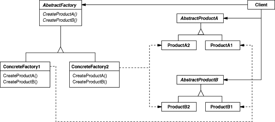

# Abstract Factory Pattern (추상 팩토리)
## 정의
- 추상 팩토리 패턴은 연관성이 있는 객체군이 여러 개 있을 경우 이들을 묶어 추상화하고, 어떤 구체적인 상황이 주어지면 팩토리 객체에서 집합으로 묶은 객체군을 구현하는 생성 패턴이다.
- 클라이언트에서 특정 객체을 사용할때 팩토리 클래스만을 참조하여 특정 객체에 대한 구현부를 감추어 역할과 구현을 분리시킬 수 있다.
- 즉, 추상 팩토리의 핵심은 제품 '군' 집합을 타입별로 찍어낼 수 있다는 점이 포인트이다.

## 구조
<p align="center"></p>

- 🐳 __AbstractFactory__ : 최상위 공장 클래스, 여러 개의 제품들을 생성하는 여러 메소드들을 추상화한다.
- 🐳 __ConcreteFactory__ : 서브 공장 클래스들은 타입에 맞는 제품 객체를 반환하도록 메소드들을 재정의한다.
- 🐳 __AbstractProduct__ : 각 타입의 제품들을 추상화한 인터페이스
- 🐳 __ConcreteProduct(ProductA ~ ProductB)__ : 각 타입의 제품 구현체들, 이들은 팩토리 객체로부터 생성된다. 
- 🐳 __Client__ : Client는 추상화된 인터페이스만을 이용하여 제품을 받기 때문에 구체적인 제품, 공장에 대해서는 모른다.


## 흐름
### 클래스 구성
#### 제품(Product) 클래스
```java
// Product A 제품군
interface AbstractProductA {
}

// Product A - 1
class ConcreteProductA1 implements AbstractProductA {
}

// Product A - 2
class ConcreteProductA2 implements AbstractProductA {
}
```
```java
// Product B 제품군
interface AbstractProductB {
}

// Product B - 1
class ConcreteProductB1 implements AbstractProductB {
}

// Product B - 2
class ConcreteProductB2 implements AbstractProductB {
}
```

#### 공장(Factory) 클래스
```java
interface AbstractFactory {
    AbstractProductA createProductA();
    AbstractProductB createProductB();
}

// Product A1 와 B1 제품군을 생산하는 공장군 1 
class ConcreteFactory1 implements AbstractFactory {
    public AbstractProductA createProductA() {
        return new ConcreteProductA1();
    }
    public AbstractProductB createProductB() {
        return new ConcreteProductB1();
    }
}

// Product A2 와 B2 제품군을 생산하는 공장군 2
class ConcreteFactory2 implements AbstractFactory {
    public AbstractProductA createProductA() {
        return new ConcreteProductA2();
    }
    public AbstractProductB createProductB() {
        return new ConcreteProductB2();
    }
}
```

### 클래스 흐름
```java
class Client {
    public static void main(String[] args) {
    	AbstractFactory factory = null;
        
        // 1. 공장군 1을 가동시킨다.
        factory = new ConcreteFactory1();

        // 2. 공장군 1을 통해 제품군 A1를 생성하도록 한다 (클라이언트는 구체적인 구현은 모르고 인터페이스에 의존한다)
        AbstractProductA product_A1 = factory.createProductA();
        System.out.println(product_A1.getClass().getName()); // ConcreteProductA1

        // 3. 공장군 2를 가동시킨다.
        factory = new ConcreteFactory2();

        // 4. 공장군 2를 통해 제품군 A2를 생성하도록 한다 (클라이언트는 구체적인 구현은 모르고 인터페이스에 의존한다)
        AbstractProductA product_A2 = factory.createProductA();
        System.out.println(product_A2.getClass().getName()); // ConcreteProductA2
    }
}
```
- 코드를 보면 똑같은 createProductA() 메서드를 호출하지만 어떤 팩토리 객체인가에 따라 반환되는 제품군이 다르게 된다.

## 특징
### 사용 시점
- 관련 제품의 다양한 제품군과 함께 작동해야 할 때, 해당 제품의 구체적인 클래스에 의존하고 싶지 않은 경우
- 여러 제품군 중 하나를 선택해서 시스템을 설정해야하고 한 번 구성한 제품을 다른 것으로 대체할 수도 있을 때
- 제품에 대한 클래스 라이브러리를 제공하고, 그들의 구현이 아닌 인터페이스를 노출시키고 싶을 때
### 장점
- 객체를 생성하는 코드를 분리하여 클라이언트 코드와 결합도를 낮출 수 있다.
- 제품군을 쉽게 대체할 수 있다.
- 단일 책임 원칙 준수
- 개방 / 폐쇄 원칙 준수
### 단점
- 각 구현체마다 팩토리 객체들을 모두 구현해주어야 하기 때문에 객체가 늘어날 때마다 클래스가 증가하여 코드의 복잡성이 증가한다. (팩토리 패턴의 공통적인 문제점)
- 기존 추상 팩토리의 세부사항이 변경되면 모든 팩토리에 대한 수정이 필요해진다. 이는 추상 팩토리와 모든 서브클래스의 수정을 가져온다. 
- 새로운 종류의 제품을 지원하는 것이 어렵다. 새로운 제품이 추가되면 팩토리 구현 로직 자체를 변경해야 한다.

## 예시
- 컴퓨터 화면에 컴포넌트 요소들을 화면에 그리는 로직을 구현한다고 가정하자. 버튼(Button), CheckBox(체크박스), TextEdit(텍스트박스) 3가지 요소를 화면에 그리기 위해 각기 객체로 지정한다.
- 그런데 컴퓨터 OS에는 윈도우(Window)와 맥(Mac) 종류가 나뉘는데 어떤 OS인가에 따라서 모양이 달라질 수 있기 때문에 각기 생성하여 구현하여야 한다고 한다.
- 정리하면 이 3가지 객체들은 하나의 컴포넌트(Component) 군으로 묶을 수 있으며 또한 OS별 군으로 나뉘게 된다.

<p align="center"></p>

```java
interface Component {
    void render(); // 요소 그리기
}

/* ---------------------------------------------------------- */

abstract class Button implements Component {
}

class WindowButton extends Button {
    @Override
    public void render() {
        System.out.println("윈도우 버튼 생성 완료");
    }
}

class MacButton extends Button {
    @Override
    public void render() {
        System.out.println("맥 버튼 생성 완료");
    }
}

/* ---------------------------------------------------------- */

abstract class CheckBox implements Component {
}

class WindowCheckBox extends CheckBox {
    @Override
    public void render() {
        System.out.println("윈도우 체크박스 생성 완료");
    }
}

class MacCheckBox extends CheckBox {
    @Override
    public void render() {
        System.out.println("맥 체크박스 생성 완료");
    }
}

/* ---------------------------------------------------------- */

abstract class TextEdit implements Component {
}

class WindowTextEdit extends TextEdit {
    @Override
    public void render() {
        System.out.println("윈도우 텍스트박스 생성 완료");
    }
}

class MacTextEdit extends TextEdit {
    @Override
    public void render() {
        System.out.println("맥 텍스트박스 생성 완료");
    }
}
```

### 팩토리 메서드 패턴으로 구현
-  팩토리 메서드 패턴의 공장 객체는 한 가지 종류의 컴포넌트만 생성하는 구조이다. 팩토리 메서드의 초점은 추상화된 팩토리 메서드를 각 서브 공장 클래스가 재정의하여 제품 객체를 생성하는 것이기 때문이다.
-  그렇기 때문에 버튼을 생성하더라도 어느 OS 실행 환경인지는 메서드 내에서 분기문을 통해 구분해주어야 한다.

```java
interface ComponentFactoryMethod {
    Component createOperation(String type); // 템플릿
    Component createComponent(String type); // 팩토리 메서드
}

class ButtonFactory implements ComponentFactoryMethod {

    public Button createOperation(String type) {
        Button button = createComponent(type);
        button.추가설정();
        return button;
    }

    public Button createComponent(String type) {

        Button button = null;

        switch (type.toLowerCase()) {
            case "window":
                button = new WindowButton();
                break;

            case "mac":
                button = new MacButton();
                break;
        }

        return button;
    }
}

class CheckBoxFactory implements ComponentFactoryMethod {
    public CheckBox createOperation(String type) {
        CheckBox checkbox = createComponent(type);
        checkbox.추가설정();
        return checkbox;
    }

    public CheckBox createComponent(String type) {

        CheckBox checkbox = null;

        switch (type.toLowerCase()) {
            case "window":
                checkbox = new WindowCheckBox();
                break;

            case "mac":
                checkbox = new MacCheckBox();
                break;
        }

        return checkbox;
    }
}

class TextEditFactory implements ComponentFactoryMethod {
    public TextEdit createOperation(String type) {
        TextEdit txtedit = createComponent(type);
        txtedit.추가설정();
        return txtedit;
    }

    public TextEdit createComponent(String type) {

        TextEdit txtedit = null;

        switch (type.toLowerCase()) {
            case "window":
                txtedit = new WindowTextEdit();
                break;

            case "mac":
                txtedit = new MacTextEdit();
                break;
        }

        return txtedit;
    }
}
```
```java
public static void main(String[] args) {
    ComponentFactoryMethod factory = null;
    Button btn = null;
    CheckBox chkBox = null;

    // 윈도우 버튼 생성
    factory = new ButtonFactory();
    btn = (Button) factory.createOperation("Window");
    btn.render();

    // 맥 버튼 생성
    btn = (Button) factory.createOperation("Mac");
    btn.render();

    // 윈도우 체크 박스 생성
    factory = new CheckBoxFactory();
    chkBox = (CheckBox) factory.createOperation("Window");
    chkBox.render();

    // 맥 체크 박스 생성
    chkBox = (CheckBox) factory.createOperation("Mac");
    chkBox.render();
}
```

### 팩토리 메서드의 문제점
- 팩토리 메서드로 구현한 코드는 실행 자체는 문제가 없어 보이지만, 만일 기능을 확장할 필요가 있을 때 문제가 생기게 된다.
- 예를 들어 OS 종류에 Linux를 새로 추가한다고 생각해보자. 그러면 각 메서드마다 있는 분기문 로직을 일일이 수정하여야 하는데, 이 경우 OCP 원칙에 위배되는 꼴이 된다.


### 추상 팩토리 패턴으로 구현
- 팩토리 메서드의 공장 객체는 한 종류의 컴포넌트만 생성하지만, 추상 팩토리의 공장 객체는 하나의 객체에서 여러 종류의 컴포넌트들을 골라 생산할 수 있도록 구성한다.

```java
interface ComponentAbstractFactory {
    Button createButton();
    CheckBox createCheckBox();
    TextEdit createTextEdit();
}

class WindowFactory implements ComponentAbstractFactory {

    @Override
    public Button createButton() {
        return new WindowButton();
    }

    @Override
    public CheckBox createCheckBox() {
        return new WindowCheckBox();
    }

    @Override
    public TextEdit createTextEdit() {
        return new WindowTextEdit();
    }
}

class MacFactory implements ComponentAbstractFactory {

    @Override
    public Button createButton() {
        return new MacButton();
    }

    @Override
    public CheckBox createCheckBox() {
        return new MacCheckBox();
    }

    @Override
    public TextEdit createTextEdit() {
        return new MacTextEdit();
    }
}
```
```java
public static void main(String[] args) {
    ComponentAbstractFactory factory = null;

    // 윈도우 버튼 생성
    factory = new WindowFactory();
    Button WindowBtn = createBtn(factory);
    WindowBtn.render();

    // 맥 버튼 생성
    factory = new MacFactory();
    Button MacBtn = createBtn(factory);
    MacBtn.render();
}

// 추상 팩토리에서 객체를 생성하는 부분 코드는 같기 때문에 따로 메서드로 묶음 분리
public static Button createBtn(ComponentAbstractFactory fac) {
    return fac.createButton();
}
```

- 기존 팩토리 메서드에서는 다른 OS의 컴포넌트를 생성하기 위해선 문자열을 인자로 주어 메서드 내에서 분기문으로 객체 생성을 처리하였지만, 추상 팩토리에선 어떠한 팩토리 객체를 생성하느냐에 따라 똑같은 메서드를 호출해도 반환되는 결과가 다르게 된다.
- 하지만 착각하지 말아야 할 것이 추상 팩토리가 팩토리 메서드보다 무조건 좋다는 말이 아니다.
- 해당 예제처럼 어떠한 제품들에 대한 '군'을 묶어 생성해야 할때 추상 팩토리로 구성하는 것이 유지보수와 확장에 있어 더 유리하다는 것을 보여주는 것이다.


