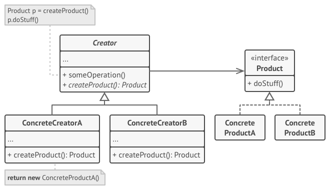
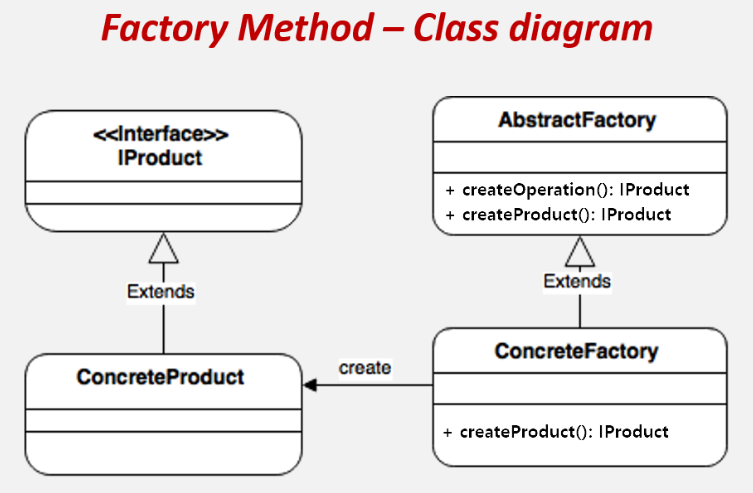
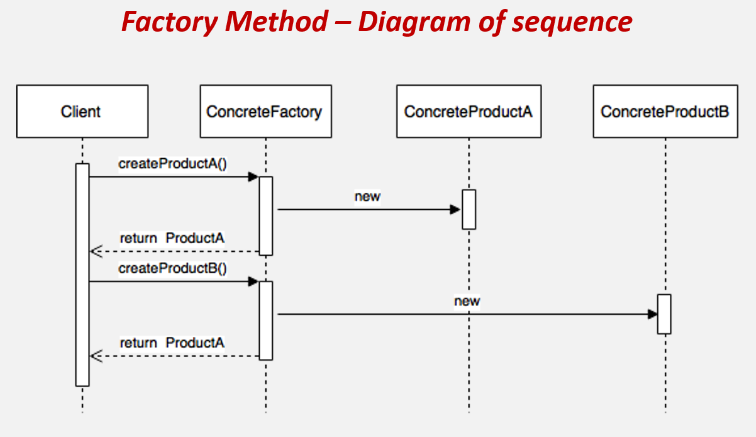

# Factory Method Pattern (팩토리 메서드 패턴)

## 정의
- 팩토리 메소드 패턴은 객체 생성을 공장(Factory) 클래스로 캡슐화 처리하여 대신 생성하게 하는 생성 디자인 패턴이다.
- 즉, 클라이언트에서 직접 new 연산자를 통해 제품 객체를 생성하는 것이 아닌, 제품 객체들을 도맡아 생성하는 공장 클래스를 만들고, 이를 상속하는 서브 공장 클래스의 메서드에서 여러가지 제품 객체 생성을 각각 책임지는 것이다.
- 또한 객체 생성에 필요한 과정을 템플릿처럼 미리 구성해놓고, 객체 생성에 관한 전처리나 후처리를 통해 생성 과정을 다양하게 처리하여 객체를 유연하게 정할 수 있는 특징도 있다.

## 구조
<p align="center"></p>

- 🐳 Creator : 최상위 공장 클래스로서, 팩토리 메서드를 추상화하여 서브 클래스로 하여금 구현하도로 함
  - 🍀 객체 생성 처리 메서드(someOperartion) : 객체 생성에 관한 전처리, 후처리를 템플릿화한 메서드
  - 🍀 팩토리 메서드(createProduct) : 서브 공장 클래스에서 재정의할 객체 생성 추상 메서드
- 🐳 ConcreteCreator : 각 서브 공장 클래스들은 이에 맞는 제품 객체를 반환하도록 생성 추상 메서드를 재정의한다. 즉, 제품 객체 하나당 그에 걸맞는 생산 공장 객체가 위치된다.
- 🐳 Product : 제품 구현체를 추상화
- 🐳 ConcreteProduct : 제품 구현체

- 정리하자면, 팩토리 메소드 패턴은 객체를 만들어내는 공장(Factory 객체)을 만드는 패턴이라고 보면 된다. 그리고 어떤 클래스의 인스턴스를 만들지는 미리 정의한 공장 서브 클래스에서 결정한다.
- 겨우 객체 생성 가지고 이런식으로 번거롭게(?) 구성하는 이유는 객체 간의 결합도가 낮아지고 유지보수에 용이해지기 때문이다.

## 흐름
### 클래스 구성
<p align="center"></p>

#### Product 클래스
```java
// 제품 객체 추상화 (인터페이스)
interface IProduct {
    void setting();
}

// 제품 구현체
class ConcreteProductA implements IProduct {
    public void setting() {
    }
}

class ConcreteProductB implements IProduct {
    public void setting() {
    }
}
```
#### Factory 클래스
```java
// 공장 객체 추상화 (추상 클래스)
abstract class AbstractFactory {

    // 객체 생성 전처리 후처리 메소드 (final로 오버라이딩 방지, 템플릿화)
    final IProduct createOperation() {
        IProduct product = createProduct(); // 서브 클래스에서 구체화한 팩토리 메서드 실행
        product.setting(); // .. 이 밖의 객체 생성에 가미할 로직 실행
        return product; // 제품 객체를 생성하고 추가 설정하고 완성된 제품을 반환
    }

    // 팩토리 메소드 : 구체적인 객체 생성 종류는 각 서브 클래스에 위임
    // protected이기 때문에 외부에 노출이 안됨
    abstract protected IProduct createProduct();
}

// 공장 객체 A (ProductA를 생성하여 반환)
class ConcreteFactoryA extends AbstractFactory {
    @Override
    public IProduct createProduct() {
        return new ConcreteProductA();
    }
}

// 공장 객체 B (ProductB를 생성하여 반환)
class ConcreteFactoryB extends AbstractFactory {
    @Override
    public IProduct createProduct() {
        return new ConcreteProductB();
    }
}
```

### 클래스 흐름
<p align="center"></p>

```java
class Client {
    public static void main(String[] args) {
        // 1. 공장 객체 생성 (리스트)
        AbstractFactory[] factory = {
                new ConcreteFactoryA(),
                new ConcreteFactoryB()
        };

        // 2. 제품A 생성 (안에서 createProduct() 와 생성 후처리 실행)
        IProduct productA = factory[0].createOperation();

        // 3. 제품B 생성 (안에서 createProduct() 와 생성 후처리 실행)
        IProduct productB = factory[1].createOperation();
    }
}
```

## 특징
### 사용 시점
- 클래스 생성과 사용의 처리 로직을 분리하여 결합도를 낮추고자 할 때
- 코드가 동작해야 하는 객체의 유형과 종속성을 캡슐화를 통해 정보 은닉 처리 할 경우
- 라이브러리 혹은 프레임워크 사용자에게 구성 요소를 확장하는 방법을 제공하려는 경우 
- 기존 객체를 재구성하는 대신 기존 객체를 재사용하여 리소스를 절약하고자 하는 경우
  - 상황에 따라 적절한 객체를 생성하는 코드는 자주 중복될 수 있다. 그리고 객체 생성 방식의 변화는 해당되는 모든 코드 부분을 변경해야 하는 문제가 발생한다. 
  - 따라서 객체의 생성 코드를 별도의 클래스 / 메서드로 분리 함으로써 객체 생성의 변화에 대해 대비를 하기 위해 팩토리 메서드 패턴을 이용한다고 보면 된다. 
  - 특정 기능의 구현은 별개의 클래스로 제공되는 것이 바람직한 설계이기 때문이다.

### 장점
- 생성자(Creator)와 구현 객체(concrete product)의 강한 결합을 피할 수 있다.
- 팩토리 메서드를 통해 객체의 생성 후 공통으로 할 일을 수행하도록 지정해줄 수 있다.
- 캡슐화, 추상화를 통해 생성되는 객체의 구체적인 타입을 감출 수 있다.
- 단일 책임 원칙 준수 : 객체 생성 코드를 한 곳(패키지, 클래스 등)으로 이동하여 코드를 유지보수하기 쉽게 할 수 있으므로 원칙을 만족
- 개방/폐쇄 원칙 준수 : 기존 코드를 수정하지 않고 새로운 유형의 제품 인스턴스를 프로그램에 도입할 수 있어 원칙을 만족 (확장성 있는 전체 프로젝트 구성이 가능)
- 생성에 대한 인터페이스 부분과 생성에 대한 구현 부분을 따로 나뉘었기 때문에 패키지 분리하여 개별로 여러 개발자가 협업을 통해 개발

### 단점
- 각 제품 구현체마다 팩토리 객체들을 모두 구현해주어야 하기 때문에, 구현체가 늘어날 때마다 팩토리 클래스가 증가하여 서브 클래스 수가 폭발한다.
- 코드의 복잡성이 증가한다.

## 예시
### 다양한 선박 팩토리 구성
#### ❌ 클린하지 않은 문제의 코드
- 가장 심플한 방법은 Ship 객체를 만들어 반환하는 메서드를 정의하는 것이다. 매개변수의 입력값에 따라 각기 다른 타입의 선박도 분기문으로 생성하도록 하였다.
```java
class Ship {
    String name, color, capacity;

    @Override
    public String toString() {
        return String.format("Ship { name: '%s', color: '%s', logo: '%s' }", name, color, capacity);
    }
}
```
```java
public static Ship orderShip(String name, String email) {
    if (name == null) {
        throw new IllegalArgumentException("배 이름을 지어주세요");
    }
    if (email == null) {
        throw new IllegalArgumentException("이메일을 남겨주세요");
    }

    // 선박 객체 생성
    Ship ship = new Ship();

    // 선박 객체 생성 후처리
    ship.name = name;

    if (name.equalsIgnoreCase("ContainerShip")) {
        ship.capacity = "20t";
    } else if (name.equalsIgnoreCase("OilTankerShip")) {
        ship.capacity = "15t";
    }

    if (name.equalsIgnoreCase("ContainerShip")) {
        ship.color = "green";
    } else if (name.equalsIgnoreCase("OilTankerShip")) {
        ship.color = "blue";
    }

    System.out.println(ship.name + " 다 만들었다고 " + email + "로 메일을 보냈습니다.");

    return ship;
}

public static void main(String[] args) {
    Ship containerShip = orderShip("ContainerShip", "inpa.naver.com");
    System.out.println(containerShip);

    Ship oilTankerShip = orderShip("OilTankerShip", "inpa.naver.com");
    System.out.println(oilTankerShip);
}
```

#### ⭕ 심플 팩토리 메서드 패턴을 적용한 코드
- 심플 팩토리 메서드 패턴이란, 객체 생성을 담당하는 팩토리 클래스를 심플하게 하나만 구성하는 방법을 말한다.
- 아래 코드와 같이 우선 각 선박 타입에 따른 선박 객체들을 상속 관계로 구성해주고, ShipFactory 클래스를 만들고 모든 선박 객체 생성을 이 공장 클래스에 위임한다.

```java
// 제품 객체
class Ship {
    String name, color, capacity;

    @Override
    public String toString() {
        return String.format("Ship { name: '%s', color: '%s', logo: '%s' }\n", name, color, capacity);
    }
}

class ContainerShip extends Ship {
    ContainerShip() {
        name = "ContainerShip";
        capacity = "20t";
        color = "green";
    }
}

class OilTankerShip extends Ship {
    OilTankerShip() {
        name = "OilTankerShip";
        capacity = "15t";
        color = "blue";
    }
}
```
```java
// 공장 객체
class ShipFactory {

    final Ship orderShip(String name, String email) {
        validate(name, email);

        Ship ship = createShip(name); // 선박 객체 생성

        sendEmailTo(email, ship);

        return ship;
    }

    private Ship createShip(String name) {
        Ship ship = null;
        if (name.equalsIgnoreCase("ContainerShip")) {
            ship = new ContainerShip();
        } else if (name.equalsIgnoreCase("OilTankerShip")) {
            ship = new OilTankerShip();
        }
        return ship;
    }

    private void validate(String name, String email) {
        if (name == null) {
            throw new IllegalArgumentException("배 이름을 지어주세요");
        }
        if (email == null) {
            throw new IllegalArgumentException("이메일을 남겨주세요");
        }
    }

    private void sendEmailTo(String email, Ship ship) {
        System.out.println(ship.name + " 다 만들었다고 " + email + "로 메일을 보냈습니다.");
    }
}
```
```java
class Client {
    public static void main(String[] args) {
        ShipFactory factory = new ShipFactory();

        Ship containerShip = factory.orderShip("ContainerShip", "inpa.naver.com");
        System.out.println(containerShip);

        Ship oilTankerShip = factory.orderShip("OilTankerShip", "inpa.naver.com");
        System.out.println(oilTankerShip);
    }
}
```
- 하지만 아무리 객체 생성을 공장 클래스로 위임했더라도, 공장 클래스 내에서 여전히 분기 로직이 잔존해 있다.
- 즉, 확장엔 열려있고 수정엔 닫힌 개방-폐쇄 원칙을 만족하지 못하게 된다. 따라서 새로운 종류의 배를 만든다거나 배를 만드는 공정을 변경할 수 있으면서도- 기존에 작성했던 코드를 유지할 수 있는 구조로 변경해야 한다.


#### ✔️ 팩토리 메서드 패턴을 적용한 코드
- 잔존해 있는 분기문을 제거하고 객체 지향으로 팩토리를 구성해보자.
- 먼저 ShipFactory 클래스를 추상 클래스로 변환하고 Ship 인스턴스 생성을 책임지는 createShip() 메서드를 추상 메서드로 추상화시킨다.
- 그리고 각 선박 종류에 맞게 ShipFactory 클래스를 상속하는 서브 팩토리 클래스들을 만들고 createShip() 추상 메서드를 각 객체 특징에 맞게 재정의 하도록 한다.
- 즉, orderShip() 메서드의 공통 코드는 냅두고 Ship 인스턴스를 만드는 작업 코드는 서브 클래스가 결정하도록 하는 것이다. (어찌 보면 템플릿 메서드와 결이 비슷하다고 볼 수 있다)
- 또한 공장 생성 메소드 내부에서는 필요한 동작을 자유롭게 구현할 수 있는데, 인자를 받거나 상태에 따라서 생성할 객체를 바꿀 수도 있다. 이렇게 하면 좀 더 다양한 기능을 수행하거나 수정에 용이한 구조를 만들어낼 수 있다

```java
class Ship {
    String name, color, capacity;

    @Override
    public String toString() {
        return String.format("Ship { name: '%s', color: '%s', logo: '%s' }\n", name, color, capacity);
    }
}

class ContainerShip extends Ship {
    ContainerShip(String name, String capacity, String color) {
        this.name = name;
        this.capacity = capacity;
        this.color = color;
    }
}

class OilTankerShip extends Ship {
    OilTankerShip(String name, String capacity, String color) {
        this.name = name;
        this.capacity = capacity;
        this.color = color;
    }
}
```
```java
abstract class ShipFactory {

    // 객체 생성 전처리 / 후처리 메서드 (상속 불가)
    final Ship orderShip(String email) {
        validate(email);

        Ship ship = createShip(); // 선박 객체 생성

        sendEmailTo(email, ship);

        return ship;
    }

    // 팩토리 메서드
    abstract protected Ship createShip();

    private void validate(String email) {
        if (email == null) {
            throw new IllegalArgumentException("이메일을 남겨주세요");
        }
    }

    private void sendEmailTo(String email, Ship ship) {
        System.out.println(ship.name + " 다 만들었다고 " + email + "로 메일을 보냈습니다.");
    }
}

class ContainerShipFactory extends ShipFactory {
    @Override
    protected Ship createShip() {
        return new ContainerShip("ContainerShip", "20t", "green");
    }
}

class OilTankerShipFactory extends ShipFactory {
    @Override
    protected Ship createShip() {
        return new OilTankerShip("OilTankerShip", "15t", "blue");
    }
}
```
```java
class Client {
    public static void main(String[] args) {
        // 전용 선박 생산 공장 객체를 통해 선박을 생성
        Ship containerShip = new ContainerShipFactory().orderShip("inpa.naver.com");
        System.out.println(containerShip);

        Ship oilTankerShip = new OilTankerShipFactory().orderShip("inpa.naver.com");
        System.out.println(oilTankerShip);
    }
}
```
- 선박 타입명을 입력값으로 줘서 분기문을 통해 선박 제품을 생성하는 것이 아닌, 전용 선박 생산 공장 객체를 통해 선박을 생성함으로써, 수정에 닫혀있고 확장에 열려있는 구조를 구성할 수 있게 된다.
- 만일 BattleShip이라는 새로운 종류의 선박 제품을 추가한다고 가정하면, 간단하게 제품 객체와 공장 객체를 각각 정의하고 상속시키기만 하면 기존에 작성했던 코드는 수정 없이 확장된다.

#### 팩토리 객체를 싱글톤화 하기 🛠️
- 객체를 생성하는 공장 객체는 여러 개 있을 필요성이 없다. 따라서 싱글톤 객체로 구성하여 유일한 인스턴스로 만들어 두는 것이 베스트 초이스이다.
- 물론 위와 같이 메서드 호출용으로 일회용으로 쓰인 인스턴스는 JVM의 가비지 컬렉션(GC)에 의해 자동으로 지워지지만, 이런 가비지가 늘어나면 Stop-the-world에 리소스가 많이 쓰이게 된다.


## Factory Method 패턴의 실사용
### Java
- 매개변수의 값에 따라 또는 메서드에 따라 각기 다른 인스턴스를 리턴하는 단순한 버전의 팩토리 패턴으로서 팩토리 메서드 패턴과는 조금 다르다.
- java.util.Calendar 의 getInstance()
- java.util.ResourceBundle 의 getBundle()
- java.text.NumberFormat 의 getInstance()
- java.nio.charset.Charset 의 forName()
- java.net.URLStreamHandlerFactory 의 createURLStreamHandler(String)
- java.util.EnumSet 의 of()
- javax.xml.bind.JAXBContext 의 createMarshaller() and other similar methods
 
#### NumberFormat의 getInstance()
- 국가 또는 화폐에 따라 다른 표현 방식을 커버하기 위해 팩토리 메소드 패턴으로 디자인 되었다.
- NumberFormat을 구현하는 클래스는 DecimalFormat, ExponentialFormat 등이 있다.

```java
public static void main(String[] args) {
    // 팩토리 메서드로 구현체를 생성하여 반환
    NumberFormat currencyFormatter = NumberFormat.getCurrencyInstance();
    NumberFormat percentFormatter = NumberFormat.getPercentInstance();

    double x = 0.1;

    System.out.println(currencyFormatter.format(x)); // $0.10를 출력한다.
    System.out.println(percentFormatter.format(x)); // 10%를 출력한다.
}
```

#### Calendar의 getInstance()
- getInstance()를 호출할 때마다 새로운 Calendar 객체가 생성
- Calendar는 Gregorian 형식과 Julian 형식이 있는데, 이 두가지 경우를 모두 커버하기 위해 팩토리 메소드 패턴으로 디자인 되었다.

```java
public static void main(String[] args) {
    // 팩토리 메서드로 구현체를 생성하여 반환
    System.out.println("Calendar 예시 : ", Calendar.getInstance());
}
```

### Spring Framework
#### BeanFactory
- Object 타입의 Product 를 만드는 BeanFactory 라는 Creator
- BeanFactory가 Creator 인터페이스이고 이를 구현한 ClassPathXmlApplicationContext, AnnotationConfigApplicationContext가 ConcreteCreator이다.
- 여기서 넘겨주는 Product는 Object 타입이고 이를 넘겨 받는 인스턴스가 ConcreateProduct가 된다.
- 컴포넌트 스캔, bean 설정 어노테이션, xml 파일 등의 bean들이 결국 ConcreateProduct에 해당되는 것
- ioc 컨테이너에 해당되는 클래스가 bean 팩토리 인데 이 부분에 녹아져 있는 패턴이 팩토리 메서드 패턴이다.

```java
// 컴포넌트 스캔, bean 설정 어노테이션, xml 파일 등의 bean 들을 매개변수로 주어 ConcreateProduct 를 반환
BeanFactory xmlFactory = new ClassPathXmlApplicationContext("config.xml");
String hello = xmlFactory.getBean("hello", String.class);

BeanFactory javaFactory = new AnnotationConfigApplicationContext(Config.class);
String hi = javaFactory.getBean("hi", String.class);
```

## 비슷한 디자인 패턴 비교

### Factory Method vs Abstract Factory
- Abstract Factory 패턴은 Factory Method 패턴보다 한 단계 높은 추상화 수준이다.
- 유사점과 차이점을 조합해서 복합 패턴을 구성하는 것도 가능하다. 

<table style="border:1px;margin-left:auto;margin-right:auto;">
  <tr>
    <th> </th>
    <th>추상 팩토리 패턴</th>
    <th>팩토리 메서드 패턴</th>
  </tr>
  <tr>
    <td>공통점</td>
    <td colspan='2'>객체 생성을 캡슐화함으로써 구체적인 타입을 감추고 느슨한 결합 구조를 표방</td>
  </tr>
  <tr>
    <td rowspan='4'>차이점</td>
    <td>구체적인 객체 생성과정을 하위 또는 구체적인 클래스로 옮기는 것이 목적</td>
    <td>관련 있는 여러 객체를 구체적인 클래스에 의존하지 않고 만들 수 있게 해주는 것이 목적</td>
  </tr>
  <tr>
    <td>한 Factory 당 한 종류의 객체 생성 지원</td>
    <td>한 Factory에서 서로 연관된 여러 종류의 객체 생성을 지원. (제품군 생성 지원)</td>
  </tr>
  <tr>
    <td>인자에 따라 생성되는 객체의 종류가 결정</td>
    <td>인자에 따라 객체들을 생성하는 Factory의 종류가 결정. (다수의 Factory 존재)</td>
  </tr>
  <tr>
    <td>메소드 레벨에서 포커스를 맞춤으로써, 클라이언트의 ConcreteProduct 인스턴스의 생성 및 구성에 대한 의존을 감소</td>
    <td>클래스(Factory) 레벨에서 포커스를 맞춤으로써, 클라이언트의 ConcreteProduct 인스턴스 군의 생성 및 구성에 대한 의존을 감소</td>
  </tr>
</table>

### Factory Method vs Template Method
- 사실 패턴 이름의 Method는 본래 Template Method 패턴에서 차용한 단어이다. 
- 어찌 보면 Factory Method는 Template Method의 특수화이다.

<table style="border:1px;margin-left:auto;margin-right:auto;">
  <tr>
    <th> </th>
    <th>팩토리 메서드 패턴</th>
    <th>템플릿 메서드 패턴</th>
  </tr>
  <tr>
    <td>공통점</td>
    <td colspan='2'>추상 메서드를 정의하고 서브 클래스가 추상 메서드를 구현화<br>템플릿화 된 메서드에서 로직을 공통화 하기도 함</td>
  </tr>
  <tr>
    <td>차이점</td>
    <td>구현할 대상은 객체 생성 알고리즘을 지정</td>
    <td>구현할 대상은 실행할 전략 알고리즘을 지정</td>
  </tr>
</table>
