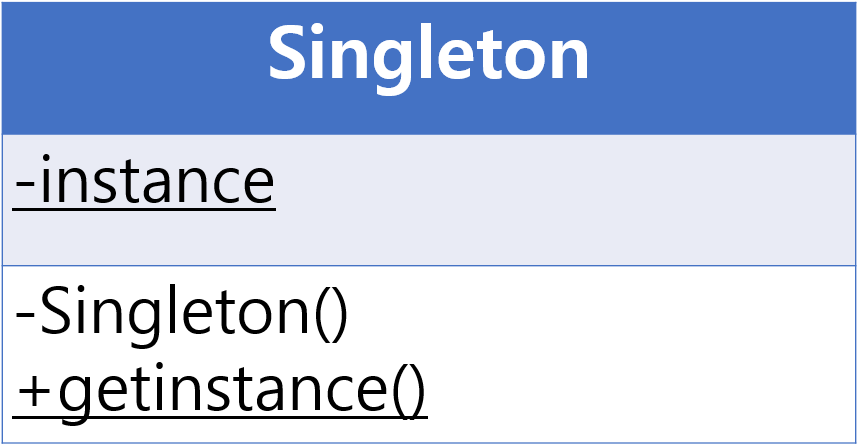
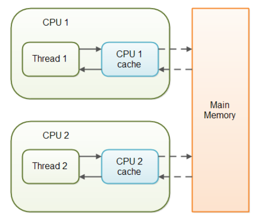

# Singleton Pattern (싱글톤 패턴)

## 개요
- 싱글톤 패턴은 디자인 패턴들 중에서 가장 개념적으로 간단한 패턴이다.
- 하지만 간단한 만큼 이 패턴에 대해 코드만 던져주고 끝내버리는 경우가 있어, 어디에 쓰이는지 어떠한 문제가 있는지 제대로 알지 못하고 얼렁뚱땅 넘어가버리는 경우가 많다.
- 본 글에서는 기술 면접의 단골 질문이면서 간단하지만 결코 간단하지 않은 디자인 패턴의 싱글톤 패턴에 대해 꼼꼼하게 알아가 보도록 한다.

## 정의
- 싱글톤 패턴이란 단 하나의 유일한 객체를 만들기 위한 코드 패턴이다. 쉽게 말하자면 메모리 절약을 위해 인스턴스가 필요할 때 똑같은 인스턴스를 새로 만들지 않고 기존의 인스턴스를 가져와 활용하는 기법을 말한다.
- 우리가 전역 변수라는 걸 만들어 이용하는 이유는 똑같은 데이터를 메서드마다 지역 변수로 선언해서 사용하면 낭비인 반면, 전역에서 한번만 데이터를 선언하고 가져와 사용하면 효율적이기 때문이다.
- 이러한 개념을 그대로 클래스에 대입한 것이 싱글톤 패턴이라고 이해하면 된다.
  - 따라서 보통 싱글톤 패턴이 적용된 객체가 필요한 경우는 그 객체가 리소스를 많이 차지하는 역할을 하는 무거운 클래스일때 적합하다.
- 대표적으로 데이터베이스 연결 모듈을 예로 들 수 있는데, 데이터베이스에 접속하는 작업(I/O 바운드)은 그 자체로 무거운 작업에 속하며 또한 한번만 객체를 생성하고 돌려쓰면 되지 굳이 여러 번 생성할 필요가 없다.
- 이밖에도 디스크 연결, 네트워크 통신, DBCP 커넥션풀, 스레드풀, 캐시, 로그 기록 객체 등에 이용된다. 즉, 어플리케이션에서 유일해야 하며 유일한 것이 좋은 것을 싱글톤 객체로 만들면 된다고 보면 된다.

## 구현 원리
<p align="center"></p>

- 어렵게 생각할 것 없이 싱글톤으로 이용할 클래스를 외부에서 마구잡이로 new 생성자를 통해 인스턴스화 하는 것을 제한하기 위해 클래스 생성자 메서드에 private 키워드를 붙여주면 된다.
- 위 그림에서 볼 수 있듯 getInstance()라는 메서드에 생성자 초기화를 해주어, 만일 클라이언트가 싱글톤 클래스를 생성해서 사용하려면 getInstance() 라는 메서드 실행을 통해 instance 필드 변수가 null 일경우 초기화를 진행하고 null이 아닐 경우 이미 생성된 객체를 반환하는 식으로 구성하면 된다.
```java
public class Main {
    public static void main(String[] args) {
        // Singleton.getInstance() 를 통해 싱글톤 객체를 각기 변수마다 받아와도 똑같은 객체 주소를 가리킴
        Singleton i1 = Singleton.getInstance();
        Singleton i2 = Singleton.getInstance();
        Singleton i3 = Singleton.getInstance();

        System.out.println(i1.toString()); // Singleton@1b6d3586
        System.out.println(i2.toString()); // Singleton@1b6d3586
        System.out.println(i3.toString()); // Singleton@1b6d3586

        System.out.println(i1 == i2); // true
    }
}
```
- 위 코드는 싱글톤으로 구성된 클래스를 외부에서 불러오는 예제이다.
- 정적 메소드로 getInstance()를 통해 객체를 불러와 변수에 저장하고 이를 출력해보면 똑같은 객체 주소를 가지고 있는 걸 볼 수 있다.
- 즉, 객체 하나만 생성하고 여러 변수에 불러와도 돌려쓰기를 한 것이다.


## 구현 기법 종류
- 어떠한 목적을 구현하기 위해 코드 패턴이라는 것이 꼭 한 가지만 있는 것은 아니다. 여러 가지 코드 기법들이 존재하여 이들 중 가장 최적화된 패턴을 상황에 맞게 사용하는 것이 핵심이다.
- 다음은 싱글톤 패턴을 구현하는 코드 기법들이다.
- 총 7가지가 있으며 이들은 모두 싱글톤을 지향한다는 점에서는 같지만 각기 코드 패턴마다 장단점이 존재한다. 각 순서마다 1번부터 조금씩 단점을 보완하는 식으로 보면 된다.

1. Eager Initialization
2. Static block initialization
3. Lazy initialization
4. Thread safe initialization
5. Double-Checked Locking
6. Bill Pugh Solution
7. Enum 이용

### 1) Eager Initialization
```java
class Singleton {
    // 싱글톤 클래스 객체를 담을 인스턴스 변수
    private static final Singleton INSTANCE = new Singleton();

    // 생성자를 private로 선언 (외부에서 new 사용 X)
    private Singleton() {}

    public static Singleton getInstance() {
        return INSTANCE;
    }
}
```
- 한번만 미리 만들어두는, 가장 직관적이면서도 심플한 기법
- static final 이라 멀티 쓰레드 환경에서도 안전함
- 그러나 static 멤버는 당장 객체를 사용하지 않더라도 메모리에 적재하기 때문에 만일 리소스가 큰 객체일 경우, 공간 자원 낭비가 발생함
- 예외 처리를 할 수 없음

### 2) Static block initialization
```java
class Singleton {
    // 싱글톤 클래스 객체를 담을 인스턴스 변수
    private static Singleton instance;

    // 생성자를 private로 선언 (외부에서 new 사용 X)
    private Singleton() {}
    
    // static 블록을 이용해 예외 처리
    static {
        try {
            instance = new Singleton();
        } catch (Exception e) {
            throw new RuntimeException("싱글톤 객체 생성 오류");
        }
    }

    public static Singleton getInstance() {
        return instance;
    }
}
```
> __static block__ : 클래스가 JVM에 처음 로드될 때 실행될 Java 클래스 내부의 명령문 블록
- static block을 이용해 예외를 잡을 수 있음
- 그러나 여전히 static의 특성으로 사용하지도 않는데도 공간을 차지함

### 3) Lazy initialization
```java
class Singleton {
    // 싱글톤 클래스 객체를 담을 인스턴스 변수
    private static Singleton instance;

    // 생성자를 private로 선언 (외부에서 new 사용 X)
    private Singleton() {}
	
    // 외부에서 정적 메서드를 호출하면 그제서야 초기화 진행 (lazy)
    public static Singleton getInstance() {
        if (instance == null) {
            instance = new Singleton(); // 오직 1개의 객체만 생성
        }
        return instance;
    }
}
```
- 객체 생성에 대한 관리를 내부적으로 처리
- 메서드를 호출했을 때 인스턴스 변수의 null 유무에 따라 초기화하거나 있는 걸 반환하는 기법
- 위의 미사용 고정 메모리 차지의 한계점을 극복
- 그러나 쓰레드 세이프(Thread Safe) 하지 않은 치명적인 단점을 가지고 있음

#### 멀티 쓰레드 환경에서의 치명적인 문제점
- 자바는 멀티 쓰레드 언어인데, 이 멀티 쓰레드 환경에서 쓰레드 세이프 하지 않다는 점이 치명적이다.
- 각 스레드는 자신의 실행 단위를 기억하면서 코드를 위에서 아래로 읽어간다. 따라서 다음과 같은 동시성으로 인한 코드 실행 문제점이 발생 할 수 있게 된다.

  1. 스레드 A, 스레드 B 가 존재한다고 가정한다.
  2. 스레드 A가 if문을 평가하고 인스턴스 생성 코드로 진입하였다. (아직 초기화 진행 X)
  3. 그런데 그때 스레드 B가 if문을 평가한다. 아직 스레드 A가 인스턴스화 코드를 실행을 안시켰기 때문에 이 if문도 참이 되게 된다.
  4. 그러면 결과적으로 스레드 A와 B가 인스턴스 초기화 코드를 두번 실행하는 꼴이 된다. (원자성이 결여)

### 4) Thread safe initialization
```java
class Singleton {
    private static Singleton instance;

    private Singleton() {}

    // synchronized 메서드
    public static synchronized Singleton getInstance() {
        if (instance == null) {
            instance = new Singleton();
        }
        return instance;
    }
}
```
- synchronized 키워드를 통해 메서드에 쓰레드들을 하나하나씩 접근하게 하도록 설정한다. (동기화)
- 하지만 여러 개의 모듈들이 매번 객체를 가져올 때 synchronized 메서드를 매번 호출하여 동기화 처리 작업에 overhead가 발생해 성능 하락이 발생한다.

### 5) Double-Checked Locking
```java
class Singleton {
    private static volatile Singleton instance; // volatile 키워드 적용

    private Singleton() {}

    public static Singleton getInstance() {
        if (instance == null) {
        	// 메서드에 동기화 거는게 아닌, Singleton 클래스 자체를 동기화 걸어버림
            synchronized (Singleton.class) { 
                if(instance == null) { 
                    instance = new Singleton(); // 최초 초기화만 동기화 작업이 일어나서 리소스 낭비를 최소화
                }
            }
        }
        return instance; // 최초 초기화가 되면 앞으로 생성된 인스턴스만 반환
    }
}
```
- 매번 synchronized 동기화를 실행하는 것이 문제라면, 최초 초기화할 때만 적용하고 이미 만들어진 인스턴스를 반환할 때는 사용하지 않도록 하는 기법
- 이 때 인스턴스 필드에 volatile 키워드를 붙여주어야 I/O 불일치 문제를 해결 할 수 있다.
- 그러나 volatile 키워드를 이용하기 위해선 JVM 1.5이상이어야 되고, JVM에 대한 심층적인 이해가 필요하여, JVM에 따라서 여전히 쓰레드 세이프 하지 않는 경우가 발생하기 때문에 사용하기를 지양하는 편이다.

#### volatile 키워드
<p align="center"></p>

- Java에서는 쓰레드를 여러 개 사용할 경우, 성능을 위해서 각각의 쓰레드들은 변수를 메인 메모리(RAM)으로부터 가져오는 것이 아니라 캐시(Cache) 메모리에서 가져오게 된다.
- 문제는 비동기로 변수값을 캐시에 저장하다가, 각 쓰레드마다 할당되어 있는 캐시 메모리의 변수값이 일치하지 않을 수 있다는 점이다.
- 그래서 volatile 키워드를 통해 이 변수는 캐시에서 읽지 말고 메인 메모리에서 읽어오도록 지정해주는 것이다.

### 6) Bill Pugh Solution
- 권장되는 두 가지 방법 중 하나
- 멀티쓰레드 환경에서 안전하고 Lazy Loading(나중에 객체 생성)도 가능한 완벽한 싱글톤 기법
- 클래스 안에 내부 클래스(holder)를 두어 JVM의 클래스 로더 매커니즘과 클래스가 로드되는 시점을 이용한 방법 (스레드 세이프 만족)
- static 메소드에서는 static 멤버만을 호출할 수 있기 때문에 내부 클래스를 static으로 설정
- 이 밖에도 내부 클래스의 치명적인 문제점인 메모리 누수 문제를 해결하기 위하여 내부 클래스를 static으로 설정
- 다만 클라이언트가 임의로 싱글톤을 파괴할 수 있다는 단점을 지님 (Reflection API, 직렬화/역직렬화를 통해)

```java
class Singleton {

    private Singleton() {}

    // static 내부 클래스를 이용
    // Holder로 만들어, 클래스가 메모리에 로드되지 않고 getInstance 메서드가 호출되어야 로드됨
    private static class SingleInstanceHolder {
        private static final Singleton INSTANCE = new Singleton();
    }

    public static Singleton getInstance() {
        return SingleInstanceHolder.INSTANCE;
    }
}
```
1. 우선 내부 클래스를 static으로 선언하였기 때문에, 싱글톤 클래스가 초기화되어도 SingleInstanceHolder 내부 클래스는 메모리에 로드되지 않음
2. 어떠한 모듈에서 getInstance() 메서드를 호출할 때, SingleInstanceHolder 내부 클래스의 static 멤버를 가져와 리턴하게 되는데, 이 때 내부 클래스가 한번만 초기화되면서 싱글톤 객체를 최초로 생성 및 리턴하게 된다.
3. 마지막으로 final로 지정함으로서 다시 값이 할당되지 않도록 방지한다.

### 7) Enum 이용
```java
enum SingletonEnum {
    INSTANCE;

    private final Client dbClient;
	    SingletonEnum() {
        dbClient = Database.getClient();
    }

    public static SingletonEnum getInstance() {
        return INSTANCE;
    }

    public Client getClient() {
        return dbClient;
    }
}

public class Main {
    public static void main(String[] args) {
        SingletonEnum singleton = SingletonEnum.getInstance();
        singleton.getClient();
    }
}
```
- 권장되는 두 가지 방법 중 하나 
- enum은 애초에 멤버를 만들 때 private로 만들고 한번만 초기화하기 때문에 thread safe함.
- enum 내에서 상수 뿐만 아니라, 변수나 메서드를 선언해 사용이 가능하기 때문에, 이를 이용해 싱글톤 클래스 처럼 응용이 가능
- 위의 Bill Pugh Solution 기법과 달리, 클라이언트에서 Reflection을 통한 공격에도 안전
- 하지만 만일 싱글톤 클래스를 멀티톤(일반적인 클래스)으로 마이그레이션 해야할 때 처음부터 코드를 다시 짜야 되는 단점이 존재한다. (개발 스펙은 언제 어디서 변경될 수 있기 때문에)
- 클래스 상속이 필요할 때, enum 외의 클래스 상속은 불가능하다.

### 결론
- 최종 정리하자면, 싱글톤 패턴 클래스를 만들기 위해서는 Bill Pugh Solution 기법을 사용하거나 Enum으로 만들어 사용하면 된다.
- 다만, 이 둘의 사용 선택은 자신의 싱글톤 클래스의 목적에 따라 갈리게 된다고 보면 된다.
  1. LaszHolder : 성능이 중요시 되는 환경
  2. Enum : 직렬화, 안정성 중요시 되는 환경

## 싱글톤 패턴은 안티 패턴?
- 이처럼 싱글톤 클래스는 고정된 메모리 영역을 가지고 하나의 인스턴스만 사용하기 때문에 메모리 낭비를 방지할 수 있으며, DBCP(DataBase Connection Pool)처럼 공통된 객체를 여러 개 생성해야하는 상황에서 많이 사용된다.
- 하지만 싱글톤 패턴은 얻는 이점과 더불어 많은 문제점들을 수반하기 때문에 trade-off를 잘 고려해야 한다.

### 싱글톤의 문제점
#### 1) 모듈간 의존성이 높아진다.
- 대부분의 싱글톤을 이용하는 경우 인터페이스가 아닌 클래스의 객체를 미리 생성하고 정적 메소드를 이용해 사용하기 때문에 클래스 사이에 강한 의존성과 높은 결합이 생기게 된다.
- 즉, 하나의 싱글톤 클래스를 여러 모듈들이 공유를 하니까, 만일 싱글톤의 인스턴스가 변경되면 이를 참조하는 모듈들도 수정이 필요하게 된다.
- 또한 클라이언트 코드에서 너무 많은 곳에서 사용하면 클래스간의 결합도가 높아져 오히려 패턴을 사용 안하느니만 못하게 될 수도 있다.

#### 2) S.O.L.I.D 원칙에 위배되는 사례가 많다.
- 우선 싱글톤 인스턴스 자체가 하나만 생성하기 때문에 여러가지 책임을 지니게 되는 경우가 많아 단일 책임 원칙(SRP)를 위반하기도 하고, 싱글톤 인스턴스가 혼자 너무 많은 일을 하거나, 많은 데이터를 공유시키면 다른 클래스들 간의 결합도가 높아지게 되어 개방-폐쇄 원칙(OCP)에도 위배된다.
- 그리고 의존 관계상 클라이언트가 인터페이스와 같은 추상화가 아닌, 구체 클래스에 의존하게 되어 의존 역전 원칙(DIP)도 위반하게 된다.
- 따라서 싱글톤 인스턴스를 너무 많은 곳에서 사용할 경우 잘못된 디자인 형태가 될 수도 있다.
- 그래서 싱글톤 패턴을 객제 지향 프로그래밍의 안티 패턴이라고 불리기도 한다.

#### 3) TDD 단위 테스트가 어렵다.
- 마지막으로 싱글콘 클래스를 사용하는 모듈을 테스트하기 어렵다는 것이다.
- 단위 테스트를 할때, 단위 테스트는 테스트가 서로 독립적이어야 하며 테스트를 어떤 순서로든 실행 할 수 있어야 하는데, 싱글톤 인스턴스는 자원을 공유하고 있기 때문에, 테스트가 결함없이 수행되려면 매번 인스턴스의 상태를 초기화시켜 주어야 한다.
- 그렇지 않으면 어플리케이션 전역에서 상태를 공유하기 때문에 테스트가 온전하게 수행되지 못할 수도 있다.
- 많은 테스트 프레임워크가 Mock 객체를 생성할 때 상속에 의존하기 때문에 싱글턴의 클라이언트 코드를 테스트하기 어렵다.

## 결론
- 이처럼 싱글톤 기법은 오직 한 개의 인스턴스 생성을 보증하여 효율을 찾을 수 있지만, 그에 못지않게 수반되는 문제점도 많다.
- 결과적으로 이러한 문제들을 안고 있는 싱글톤 패턴은 유연성이 많이 떨어지는 패턴이라고 할 수 있다.
- 그래서 직접 유저가 만들어 사용하는 것 보다는, 스프링 컨테이너 같은 프레임워크의 도움을 받으면 싱글톤 패턴의 문제점들을 보완하면서 장점의 혜택을 누릴 수 있다.
- 스프링 프레임워크에서는 싱글톤 패턴이란 것이 없고 내부적으로 클래스의 제어를 IoC(Inversion Of Control) 방식의 컨테이너에게 넘겨 컨테이너가 관리하기 때문에, 이를 통해 평범한 객체도 하나의 인스턴스 뿐인 싱글턴으로 존재가 가능하기 때문에 싱글톤 단점이 없다.
- 따라서 만일 프레임워크 도움 없이 싱글톤 패턴을 적용하고 싶다면, 위에서 살펴본 장단점을 잘 고려하여 사용하는 것이 좋을 것이다.


