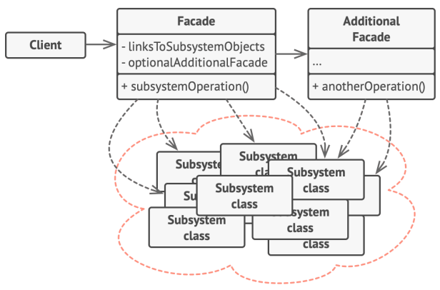
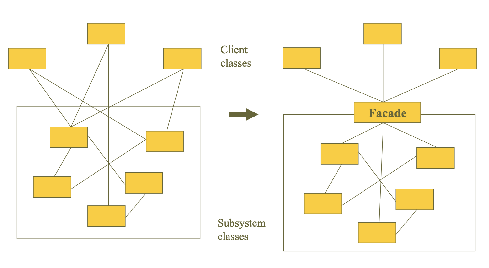

# Facade Pattern (퍼사드 패턴)

## 정의
- 퍼사드 패턴(Facade Pattern)은 사용하기 복잡한 클래스 라이브러리에 대해 사용하기 편하게 간편한 인터페이스(API)를 구성하기 위한 구조 패턴이다.
- 예를 들어 라이브러리의 각 클래스와 메서드들이 어떤 목적의 동작인지 이해하기 어려워 바로 가져다 쓰기에는 난이도가 높을 때, 이에 대한 적절한 네이밍과 정리를 통해 사용자로 하여금 쉽게 라이브러리를 다룰 수 있도록 인터페이스를 만든다.
- 본래 프로그램이라는 것은 업데이트를 통해 점점 커지게 된다. 버전이 올라갈수록 많은 클래스들이 만들어져 서로 관계를 맺으면서 점점 복잡해지게 된다. 그래서 커다란 솔루션을 구성하려면 상호 관련된 많은 클래스들을 적절히 제어해야 할 필요성이 있다.
- 이 때 이 처리를 개별적으로 제어하는 것이 아닌 일종의 '창구'를 준비하여 중계할 수 있도록 구성해준다면, 사용자는 창구를 통해서 간단한 명령 요구만 내리면 요구에 대해 필요한 모든 집약적 행위들을 창구가 알아서 처리해 결과를 내주게 된다.
- 이처럼 퍼사드(Facade) 패턴은 복잡하게 얽혀 있는 것을 정리해서 사용하기 편한 인터페이스를 고객에게 제공한다고 보면 된다. 그래서 고객은 복잡한 시스템을 알 필요없이 시스템의 외부에 대해서 단순한 인터페이스를 이용하기만 하면 된다.
- 퍼사드를 이용하면 자칫 동작의 목적과 같은 중요한 사항을 놓치는 실수를 줄일 수 있다.

## 구조
<p align="center"></p>

- 🐳 Facade : 서브 시스템 기능을 편리하게 사용할 수 있도록 하기 위해 여러 시스템과 상호 작용하는 복잡한 로직을 재정리해서 높은 레벨의 인터페이스를 구성한다. Facade 역할은 서브 시스템의 많은 역할에 대해 ‘단순한 창구’가 된다. 클라이언트와 서브 시스템이 서로 긴밀하게 연결되지 않도록 한다.
- 🐳 Additional Facade : 퍼사드 클래스는 반드시 한 개만 존재해야 한다는 규칙같은 건 없다. 연관 되지 않은 기능이 있다면 얼마든지 퍼사드 2세로 분리한다. 이 퍼사드 2세는 다른 퍼사드에서 사용할 수도 있고 클라이언트에서 직접 접근할 수도 있다.
- 🐳 SubSystem(하위 시스템) : 수십 가지 라이브러리 혹은 클래스들
- 🐳 Client : 서브 시스템에 직접 접근하는 대신 Facade를 사용한다


- 퍼사드 패턴은 전략 패턴이나 팩토리 패턴과 같은 여타 다른 디자인 패턴과는 다르게 클래스 구조가 정형화되지 않은 패턴이다. 반드시 클래스 위치는 어떻고 어떤 형식으로 위임을 해야 하고 이런 것이 없다.
- 그냥 퍼사드 클래스를 만들어 적절히 기능 집약화만 해주면 그게 디자인 패턴이 되는 것이다. (패턴이라기보단 논리에 가깝다)
- C언어나 파이썬에서 어떠한 복잡한 로직의 코드가 있으면 이걸 main 함수에서 모두 실행하는 것이 아니라, 함수(function) 분리를 통해 main 함수의 코드를 심플하게 구성해본 경험이 있을 것이다. 이를 객체 지향 프로그래밍 관점으로 치환한 것이 퍼사드 패턴이다.
- 즉, 퍼사드는 복잡한 것(내부에서 실행되고 있는 많은 클래스의 관계나 사용법)을 단순하게 보여주는 것에 초점을 둔다. 클라이언트로 하여금 복잡한 것을 의식하지 않도록 해준다. 

<p align="center"></p>

### 재귀적인 Facade 패턴의 적용
- 재귀적 퍼사드란 위에서 언급한 Additional Facade를 말하는 것이다.
- 예를 들어 다수의 클래스, 다수의 패키지를 포함하고 있는 큰 시스템에 요소 요소마다 Facade 패턴을 적용하고 다시 그 Facade를 합친 Facade를 만드는 식으로, 퍼사드를 재귀적으로 구성하면 시스템은 보다 편리하게 된다.
- 이처럼 퍼사드는 한 개만 있으라는 법은 없으며 필요에 의하면 얼마든지 늘려 의존할 수 있다.


## 특징
### 사용 시점
- 시스템이 너무 복잡할 때
- 그래서 간단한 인터페이스를 통해 복잡한 시스템을 접근하도록 하고 싶을 때
- 시스템을 사용하고 있는 외부와 결합도가 너무 높아 의존성을 낮출 때

### 장점
- 하위 시스템의 복잡성에서 코드를 분리하여, 외부에서 시스템을 사용하기 쉬워진다.
- 하위 시스템 간의 의존 관계가 많을 경우 이를 감소시키고 의존성을 한 곳으로 모을 수 있다.
- 복잡한 코드를 감춤으로써, 클라이언트가 시스템의 코드를 모르더라도 Facade 클래스만 이해하고 사용 가능하다. 

### 단점
- 퍼사드가 앱의 모든 클래스에 결합된 God 객체가 될 수 있다
- 퍼사드 클래스 자체가 서브 시스템에 대한 의존성을 가지게 되어 의존성을 완전히 피할 수는 없다.
- 어찌되었건 추가적인 코드가 늘어나는 것이기 때문에 유지보수 측면에서 cost가 더 많이 들게 된다.
- 따라서 추상화하고자 하는 시스템이 얼마나 복잡한지 퍼사드 패턴을 통해서 얻게 되는 이점과 추가적인 유지보수 비용을 비교하여 결정해야 한다.

## 예시
### 복잡한 DBMS 시스템 간편하게 재구성
- 데이터베이스로부터 어떤 데이터를 조회해서 출력해주는 JDBC와 비슷한 자바 패키지가 있다고 하자. 우리는 이 라이브러리를 이용하여 데이터베이스로부터 값을 얻어오고 화면에 데이터를 파싱해서 예쁘게 출력하려는 프로그램을 만들려고 한다.
- 패키지에는 총 4개의 Cache, DBMS, Row, Message 클래스가 존재한다. 그리고 각 행위에 대해 각 클래스들의 역할이 정해져 있다.
- DBMS에 조회된 데이터는 성능을 위해 반드시 캐시에 저장해야 되는 것을 잊지 않아야하고, 또한 데이터를 가공하기 위해서는 Message 클래스를 써야 한다. 이 수칙을 따르지 않으면 라이브러리가 제대로 작동하지 않는다.

```java
// DBMS에 저장된 데이터를 나타내는 클래스
class Row  {
    private String name;
    private String birthday;
    private String email;

    public Row(String name, String birthday, String email) {
        this.name = name;
        this.birthday = birthday;
        this.email = email;
    }

    public String getName() {
        return name;
    }

    public String getBirthday() {
        return birthday;
    }

    public String getEmail() {
        return email;
    }
}

// 데이터베이스 역할을 하는 클래스
class DBMS {
    private HashMap<String, Row> db = new HashMap<>();

    public void put(String name, Row row) {
        db.put(name, row);
    }

    // 데이터베이스에 쿼리를 날려 결과를 받아오는 메소드
    public Row query(String name) {
        try {
            Thread.sleep(500); // DB 조회 시간을 비유하여 0.5초대기로 구현
        } catch(InterruptedException e) {}

        return db.get(name.toLowerCase());
    }
}

// DBMS에서 조회된 데이터를 임시로 담아두는 클래스 (속도 향상)
class Cache {
    private HashMap<String, Row> cache = new HashMap<>();

    public void put(Row row) {
        cache.put(row.getName(), row);
    }

    public Row get(String name) {
        return cache.get(name);
    }
}

// Row 클래스를 보기좋게 출력하는 클래스
class Message {
    private Row row;

    public Message(Row row) {
        this.row = row;
    }

    public String makeName() {
        return "Name : \"" + row.getName() + "\"";
    }

    public String makeBirthday() {
        return "Birthday : " + row.getBirthday();
    }

    public String makeEmail() {
        return "Email : " + row.getEmail();
    }
}
```

#### ❌ 클린하지 않은 문제의 코드
- 문제의 코드는 당연히 라이브러리의 코드를 그대로 메인 로직에 작성하여 구현하는 것이다. 데이터를 조회하고 출력되기 까지 여러 개의 객체가 사용되고 있다.
- 물론 당장은 프로그램이 정상적으로 돌아가 서비스에는 문제가 없을지 모르겠지만, 나중에 수정과 확장에 있어 개발자가 수칙들을 까먹고 실수를 하여 서비스에 버그가 생길 수 있다.

```java
class Client {
    public static void main(String[] args) {
        // 1. 데이터베이스 생성 & 등록
        DBMS dbms = new DBMS();
        dbms.put("홍길동", new Row("홍길동", "1890-02-14", "honggildong@naver.com"));
        dbms.put("임꺽정", new Row("임꺽정", "1820-11-02", "imgguckjong@naver.com"));
        dbms.put("주몽", new Row("주몽", "710-08-27", "jumong@naver.com"));

        // 2. 캐시 생성
        Cache cache = new Cache();

        // 3. 트랜잭션에 앞서 먼저 캐시에 데이터가 있는지 조회
        String name = "홍길동";
        Row row = cache.get(name);

        // 4. 만약 캐시에 없다면
        if (row == null){
            row = dbms.query(name); // DB에 해당 데이터를 조회해서 row에 저장하고
            if(row != null) {
                cache.put(row); // 캐시에 저장
            }
        }

        // 5. dbms.query(name)에서 조회된 값이 있으면
        if(row != null) {
            Message message = new Message(row);

            System.out.println(message.makeName());
            System.out.println(message.makeBirthday());
            System.out.println(message.makeEmail());
        }
        // 6. 조회된 값이 없으면
        else {
            System.out.println(name + " 가 데이터베이스에 존재하지 않습니다.");
        }
    }
}
```

#### ✔️ 퍼사드 패턴을 적용한 코드
- 따라서 이러한 사항들을 개발자가 직접 기억해서 하나하나 따져가며 코드를 작성하는 것보다, 이 사항들을 묶은 클래스를 하나 추가해서 단순화된 인터페이스를 통해 서브 클래스를 다룸으로써 개발자의 실수를 줄이고자 하는 것이 바로 퍼사드(Facade) 패턴이다.
- 마치 교제에 있는 풀어져있는 내용들을 필기노트에 요약하듯, 퍼사드 객체에 사용 로직을 묶어 재정리함으로써 단순화시켜 개발을 보다 용이하게 해주는 것이다.

```java
class Facade {
    private DBMS dbms = new DBMS();
    private Cache cache = new Cache();

    public void insert() {
        dbms.put("홍길동", new Row("홍길동", "1890-02-14", "honggildong@naver.com"));
        dbms.put("임꺽정", new Row("임꺽정", "1820-11-02", "imgguckjong@naver.com"));
        dbms.put("주몽", new Row("주몽", "710-08-27", "jumong@naver.com"));
    }

    public void run(String name) {
        Row row = cache.get(name);

        // 1. 만약 캐시에 없다면
        if (row == null){
            row = dbms.query(name); // DB에 해당 데이터를 조회해서 row에 저장하고
            if(row != null) {
                cache.put(row); // 캐시에 저장
            }
        }

        // 2. dbms.query(name)에서 조회된 값이 있으면
        if(row != null) {
            Message message = new Message(row);

            System.out.println(message.makeName());
            System.out.println(message.makeBirthday());
            System.out.println(message.makeEmail());
        }
        // 3. 조회된 값이 없으면
        else {
            System.out.println(name + " 가 데이터베이스에 존재하지 않습니다.");
        }
    }
}
```
```java
class Client {
    public static void main(String[] args) {
        // 1. 퍼사드 객체 생성
        Facade facade = new Facade();

        // 2. db 값 insert
        facade.insert();

        // 3. 퍼사드로 데이터베이스 & 캐싱 & 메세징 로직을 한번에 조회
        String name = "홍길동";
        facade.run(name);
    }
}
```

- 퍼사드 패턴을 적용하니 메인 로직이 엄청 심플해졌다. 이처럼 퍼사드의 핵심은 인터페이스(API)를 적게 구성하는 것이다.
- 라이브러리에서 제공하는 클래스나 메소드가 많이 보이면, 프로그래머는 무엇을 사용하면 좋을지 망설이게 되고 호출하는 순서도 doc을 살펴보며 주의해야만 한다.
- 주의해야 한다는 말은 다르게 말하면 틀리기 쉽다는 것이다. 따라서 퍼사드의 메서드를 가능한 적게 구성하는 것이 좋다.

#### Tip
> 대부분의 경우 퍼사드 객체는 하나만 있어도 충분하므로, 퍼사드 클래스를 싱글톤으로 구성해주면 좋다.
