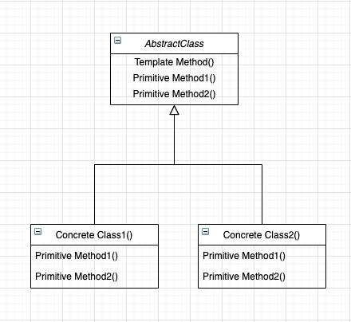

# Template Method Pattern (템플릿 메소드 패턴)

## 정의
- 템플릿 메서드(Template Method) 패턴은 여러 클래스에서 공통으로 사용하는 메서드를 템플릿화하여 상위 클래스에서 정의하고, 하위 클래스마다 세부 동작 사항을 다르게 구현하는 패턴이다.
- 즉, 변하지 않는 기능(템플릿)은 상위 클래스에 만들어두고 자주 변경되며 확장할 기능은 하위 클래스에서 만들도록 하여, 상위의 메소드 실행 동작 순서는 고정하면서 세부 실행 내용은 다양화될 수 있는 경우에 사용된다.
- 템플릿 메소드 패턴은 상속이라는 기술을 극대화하여, 알고리즘의 뼈대를 맞추는 것에 초점을 둔다. 이미 수많은 프레임워크에서 많은 부분에 템플릿 메소드 패턴 코드가 우리도 모르게 적용되어 있다.

## 구조
<p align="center"></p>

- 🐳 __AbstractClass(추상 클래스)__ : 템플릿 메소드를 구현하고, 템플릿 메소드에서 돌아가는 추상 메소드를 선언한다. 이 추상 메소드는 하위 클래스인 ConcreteClass 역할에 의해 구현된다.
- 🐳 __ConcreteClass(구현 클래스)__ : AbstractClass를 상속하고 추상 메소드를 구체적으로 구현한다. ConcreteClass에서 구현한 메소드는 AbstractClass의 템플릿 메소드에서 호출된다.

### hook 메소드
<p align="center"></p>

- 훅(hook) 메소드는 부모의 템플릿 메서드의 영향이나 순서를 제어하고 싶을때 사용되는 메서드 형태를 말한다.
- 위의 그림에서 보듯이 템플릿 메서드 내에 실행되는 동작을 step2()라는 메서드의 참, 거짓 유무에 따라 다음 스텝을 어떻게 이어나갈지 지정한다.
- 이를 통해 자식 클래스에서 좀 더 유연하게 템플릿 메서드의 알고리즘 로직을 다양화할 수 있다는 특징이 있다.
- 훅 메소드는 추상 메소드가 아닌 일반 메소드로 구현하는데, 선택적으로 오버라이드(Override)하여 자식 클래스에서 제어하거나 혹은 놔두기 위해서이다.

## 흐름
### 클래스 구성
```java
abstract class AbstractTemplate {

    // 템플릿 메소드 : 메서드 앞에 final 키워드를 붙이면 자식 클래스에서 오버라이딩이 불가능함.
	// 자식 클래스에서 상위 템플릿을 오버라이딩해서 자기마음대로 바꾸도록 하는 행위를 원천 봉쇄
    public final void templateMethod() {
        // 상속하여 구현되면 실행될 메소드들
        step1();
        step2();
        
        if(hook()) { // 안의 로직을 실행하거나 실행하지 않음
            // ...
        }
        
        step3();
    }

    boolean hook() {
        return true;
    }

    // 상속하여 사용할 것이기 때문에 protected 접근제어자 설정
    protected abstract void step1();
    protected abstract void step2();
    protected abstract void step3();
}
```
```java
class ImplementationA extends AbstractTemplate {

    @Override
    protected void step1() {}

    @Override
    protected void step2() {}

    @Override
    protected void step3() {}
}

class ImplementationB extends AbstractTemplate {

    @Override
    protected void step1() {}

    @Override
    protected void step2() {}

    @Override
    protected void step3() {}

    // hook 메소드를 오버라이드 해서 false로 하여 템플릿에서 마지막 로직이 실행되지 않도록 설정
    @Override
    protected boolean hook() {
        return false;
    }
}
```

### 클래스 흐름
```java
class Client {
   public static void main(String[] args) {
       // 1. 템플릿 메서드가 실행할 구현화한 하위 알고리즘 클래스 생성
       AbstractTemplate templateA = new ImplementationA();

       // 2. 템플릿 실행
       templateA.templateMethod();
   }
}
```

## 특징
### 사용 시점
- 클라이언트가 알고리즘의 특정 단계만 확장하고, 전체 알고리즘이나 해당 구조는 확장하지 않도록 할 때
- 동일한 기능은 상위 클래스에서 정의하면서 확장, 변화가 필요한 부분만 하위 클래스에서 구현할 때

### 장점
- 클라이언트가 대규모 알고리즘의 특정 부분만 재정의하도록 하여, 알고리즘의 다른 부분에 발생하는 변경 사항의 영향을 덜 받도록 한다.
- 상위 추상클래스로 로직을 공통화하여 코드의 중복을 줄일 수 있다.
- 서브 클래스의 역할을 줄이고, 핵심 로직을 상위 클래스에서 관리하므로서 관리가 용이해진다
  - 헐리우드 원칙 (Hollywood Principle) : 고수준 구성요소에서 저수준을 다루는 원칙 (추상화에 의존)

### 단점
- 알고리즘의 제공된 골격에 의해 유연성이 제한될 수 있다.
- 알고리즘 구조가 복잡할수록 템플릿 로직 형태를 유지하기 어려워진다.
- 추상 메소드가 많아지면서 클래스의 생성, 관리가 어려워질 수 있다.
- 상위 클래스에서 선언된 추상 메소드를 하위 클래스에서 구현할 때, 그 메소드가 어느 타이밍에서 호출되는지 클래스 로직을 이해해야 할 필요가 있다.
- 로직에 변화가 생겨 상위 클래스를 수정할 때, 모든 서브 클래스의 수정이 필요할 수 있다.
- 하위 클래스를 통해 기본 단계 구현을 억제하여 리스코프 치환 법칙을 위반할 여지가 있다.

## 예시
### 할리우드 원칙 준수
- 헐리우드 원칙(Hollywood Principle)이란 고수준 모듈(추상클래스, 인터페이스)에 의존하고 고수준 모듈에서 연락(메소드 실행)하라는 원칙이다.
- 객체끼리 이상하게 얼키고 설켜, 의존성이 복잡하게 꼬여있는 것을 '의존성 부패(dependency rot)' 라고 부르는데, 헐리우드 원칙을 활용하면 의존성 부패를 방지할 수 있게 된다.
- 자바 프로그래밍으로 간단히 말하자면, 웬만해서는 다형성을 이용해 고수준의 객체 타입에서만 메서드 실행을 하라는 의미이다.

#### ❌ 클린하지 않은 문제의 코드
- 다음 LowerA 와 LowerB 클래스가 있고 각각 메소드를 가지고 있다고 하자.
```java
class LowerA {
    void print(int num) {
        System.out.println(num);
    }

    int calculate(int n1, int n2) {
        return n1 + n2;
    }
}

class LowerB {
    void echo(int variable) {
        System.out.println(variable);
    }

    int operation(int n1, int n2) {
        return n1 * n2;
    }
}
```
- print() 와 echo() 메서드는 메서드 명만 다를 뿐 메서드 시그니처와 메서드 로직이 완전히 동일하다. 따라서 배웠던 대로 상위(고수준) 클래스로 묶어 코드 중복을 줄일 수 있다.

```java
class Higher {
    void print(int num) {
        System.out.println(num);
    }
}

class LowerA extends Higher {
    int calculate(int n1, int n2) {
        return n1 + n2;
    }
}

class LowerB extends Higher {
    int operation(int n1, int n2) {
        return n1 * n2;
    }
}
```
- 클래스 간 상속 관계를 형성하면 객체 지향의 꽃인 다형성을 이용할 수 있게 된다. 하지만 아직도 문제가 있다. 메서드 내부 로직이 달라 통일시키지 못한 calculate()와 operation() 메서드 이다.
- 만일 이 둘을 실행할 필요가 있다면 어쩔 수 없이 다운 캐스팅을 해야 된다.

```java
class Client {
    public static void main(String[] args) {
        // 업캐스팅 (고수준 모듈 타입으로 인스턴스화)
        Higher obj = new LowerA();

        // 상위 클래스로 메서드가 통일되어 있기에 메서드 실행에 문제 없음
        obj.print(1000);

        // 하지만 메서드 내부 로직이 다른 경우 상위 클래스로 묶어 줄수가 없어, 하위 클래스에 따로 정의해야 되고 다운캐스팅을 통해 실행해야 함
        ((LowerA) obj).calculate(10, 20);

        // 만일 다른 자식 클래스로 교체할 필요가 있다면,
        obj = new LowerB();

        // 역시 다운 캐스팅을 통해 실행해야 한다.
        ((LowerB) obj).operation(100, 200);
    }
}
```

#### ✔️ 템플릿 메서드 패턴을 적용한 코드
- 대부분 사람들은 '템플릿 메소드'에 국한되어 생각하는데, 템플릿 메소드는 알고리즘 뼈대일 뿐이고 템플릿 메소드 패턴의 핵심은 추상 클래스를 통한 코드 통합 및 고수준 의존 유도이다.
```java
abstract class Higher {
    void print(int num) {
        System.out.println(num);
    }

    abstract int calculate(int n1, int n2);
}

class LowerA extends Higher {

    @Override
    int calculate(int n1, int n2) {
        return n1 + n2;
    }
}

class LowerB extends Higher {

    @Override
    int calculate(int n1, int n2) {
        return n1 * n2;
    }
}
```
```java
class Client {
    public static void main(String[] args) {
        // 업캐스팅 (고수준 모듈 타입으로 인스턴스화)
        Higher obj = new LowerA();
        obj.calculate(10, 20); // 30

        obj = new LowerB();
        obj.calculate(100, 200); // 20000
    }
}
```
- 정리하자면, 상속을 통해 중복되는 코드를 상위 클래스로 통일시켜 코드 중복을 제거하고,
- 메서드 시그니처가 같지만 내부 로직이 자식 클래스마다 다른 부분은 추상 메소드를 통해 상위 클래스에서 다형성으로 메서드를 실행할 수 있도록, 고수준의 타입으로 유지한다.


### hook 메서드 응용하기
#### ❌ 클린하지 않은 문제의 코드
- 다음과 같이 커피와 홍차를 만드는 Coffee 와 Tea 클래스가 있다. 코드의 중복이 보이며 이를 템플릿 메서드 패턴으로 묶어주려고 한다.

```java
class Coffee {
    void prepareRecipe() {
        boilWater(); // "물 끓이기"
        brewCoffeeGrinds(); // "필터를 통해 커피를 우려내는 중"
        pourInCup(); // "컵에 따르는 중"
        addSugarAndMilk(); // "설탕과 우유를 추가하는 중"
    }

    public void boilWater() {
        System.out.println("물 끓이기");
    }

    public void brewCoffeeGrinds() {
        System.out.println("필터를 통해 커피를 우려내는 중");
    }

    public void pourInCup() {
        System.out.println("컵에 따르는 중");
    }

    public void addSugarAndMilk() {
        System.out.println("설탕과 우유를 추가하는 중");
    }
}


class Tea {
    void prepareRecipe() {
        boilWater(); // "물 끓이기"
        steepTeaBag(); // "차를 우리는 중"
        pourInCup(); // "컵에 따르는 중"
    }

    public void boilWater() {
        System.out.println("물 끓이기");
    }

    public void steepTeaBag() {
        System.out.println("차를 우리는 중");
    }

    public void pourInCup() {
        System.out.println("컵에 따르는 중");
    }
}
```
- 우선 boilWater() 와 pourInCup() 메서드 사이에 있는 부분은, Coffee와 Tea 클래스에서 공통적으로 실행되는 부분이니, 추상 메서드로 따로 빼서 구현하도록 하면 될 것 같다.
- 그렇다면 Coffee 클래스에만 실행되는 addSugarAndMilk() 메서드 부분은 어떻게 할까? 바로 이곳을 hook 처리하여 Coffee 자식 클래스에서만 실행되도록 하면 된다.

#### ✔️ 템플릿 메서드 패턴을 적용한 코드
```java
abstract class CaffeineBeverage {

    // 템플릿 메서드
    final void prepareRecipe() {
        boilWater(); // "물 끓이기"
        brew();
        pourInCup(); // "컵에 따르는 중"
        if (customerWantsCondiments()) {
            addCondiments();
        }
    }

    abstract void brew();

    abstract void addCondiments();

    // hook 메서드
    boolean customerWantsCondiments() {
        return false;
    }

    public void boilWater() {
        System.out.println("물 끓이기");
    }

    public void pourInCup() {
        System.out.println("컵에 따르는 중");
    }
}
```
```java
class Coffee extends CaffeineBeverage {
    public void brew() {
        System.out.println("필터를 통해 커피를 우려내는 중");
    }

    public void addCondiments() {
        System.out.println("설탕과 우유를 추가하는 중");
    }

    boolean customerWantsCondiments() {
        String answer = "";

        System.out.print("커피에 우유와 설탕을 넣어 드릴까요? (y/n) : ");

        try (BufferedReader in = new BufferedReader(new InputStreamReader(System.in))) {
            answer = in.readLine();
        } catch (IOException ioe) {
            System.out.println("IO 오류");
        }

        if (answer.toLowerCase().startsWith("y")) {
            return true;
        } else {
            return false;
        }
    }
}

class Tea extends CaffeineBeverage {
    public void brew() {
        System.out.println("차를 우리는 중");
    }

    public void addCondiments() {}
}
```
- 위의 hook 메소드 역할인 customerWantsCondiments()의 구현부를 자세히 보면, 단순 true / false 리턴을 떠나서 그 이전에 사용자로부터 입력값을 받는 등의 추가적인 로직을 구성한 걸 볼 수 있다.
- 이런식으로 hook 메소드를 좀 더 다양하게 응용할 수 있다.

```java
class client {
    public static void main(String[] args) {

        CaffeineBeverage coffee = new Coffee();
        System.out.println("커피 만드는중...");
        coffee.prepareRecipe();

        System.out.println("\n--------------------------------\n");

        CaffeineBeverage tea = new Tea();
        System.out.println("홍차 만드는중...");
        tea.prepareRecipe();
    }
}
```

## Template Method 패턴의 실사용
### Java
- java.io.InputStream, java.io.OutputStream, java.io.Reader, java.io.Writer 의 일반 메서드를 하위 클래스가 재정의
- java.util.AbstractList, java.util.AbstractSet, java.util.AbstractMap 의 일반 메서드를 하위 클래스가 재정의
- javax.servlet.http.HttpServlet의 모든 doXXX()메서드는 기본적으로 응답에 HTTP 405 "Method Not Allowed" 리턴 코드를 보내기 때문에 이들을 상속해 재정의하여 사용한다.

#### HttpServlet
- 우리가 HttpServlet 클래스를 상속하고 doGet()과 doPost() 메서드를 오버라이드하면, 상위 서블릿 객체에서 템플릿 로직을 수행하다가 doGet, doPost를 호출해야 할 때 하위 클래스를 참조하여 메서드를 실행한다.
```java
public class MyHello extends HttpServlet {

    @Override
    protected void doGet(HttpServletRequest req, HttpServletResponse resp) throws ServletException, IOException {
        super.doGet(req, resp);
    }

    @Override
    protected void doPost(HttpServletRequest req, HttpServletResponse resp) throws ServletException, IOException {
        super.doPost(req, resp);
    }
}
```

#### AbstractMap
- AbstractMap<K,V> 클래스에 정의되어있는 get() 메서드를 이를 상속하는 HashMap, TreeMap 등 서브 클래스에서 오버라이드하여 다른 방식으로 재정의한 것을 볼 수 있다.
- 꼭 추상 메소드를 재정의해야 되는게 아니라 일반 메소드도 템플릿에 고정되어 실행되는 것이라면 오버라이딩하여 재정의하면 곧 알고리즘 변화가 되기 때문이다.

##### AbstractMap<K,V> 의 get() 메소드
```java
public V get(Object key) {
    Iterator<Entry<K,V>> i = entrySet().iterator();
    if (key==null) {
        while (i.hasNext()) {
            Entry<K,V> e = i.next();
            if (e.getKey()==null)
                return e.getValue();
        }
    } else {
        while (i.hasNext()) {
            Entry<K,V> e = i.next();
            if (key.equals(e.getKey()))
                return e.getValue();
        }
    }
    return null;
}
```

##### HashMap<K,V> extends AbstractMap<K,V> 의 get() 메소드
```java
public V get(Object key) {
    Node<K,V> e;
    return (e = getNode(hash(key), key)) == null ? null : e.value;
}
```

##### TreeMap<K,V> extends AbstractMap<K,V> 의 get() 메소드
```java
public V get(Object key) {
    Entry<K,V> p = getEntry(key);
    return (p==null ? null : p.value);
}
```

### Spring Framework
#### Configuration
- WebSecurityConfigureAdapter 클래스를 상속하고 configure() 메서드를 오버라이드하면, 스프링 프레임워크의 Config 로직의 거대한 알고리즘 중 일부를 구현하게 되는 것이다.

```java
public class TemplateInSpring {

    public static void main(String[] args) {
        // TODO 템플릿-콜백 패턴
        // JdbcTemplate
        JdbcTemplate jdbcTemplate = new JdbcTemplate();
        jdbcTemplate.execute("insert");

        // RestTemplate
        RestTemplate restTemplate = new RestTemplate();

        HttpHeaders headers = new HttpHeaders();
        headers.setAccept(Arrays.asList(MediaType.APPLICATION_JSON));
        headers.set("X-COM-PERSIST", "NO");
        headers.set("X-COM-LOCATION", "USA");

        HttpEntity<String> entity = new HttpEntity<String>(headers);
        ResponseEntity<String> responseEntity = restTemplate
                .exchange("http://localhost:8080/users", HttpMethod.GET, entity, String.class);
    }

    @Configuration
    class SecurityConfig extends WebSecurityConfigurerAdapter {

        @Override
        protected void configure(HttpSecurity http) throws Exception {
            http.authorizeRequests().anyRequest().permitAll();
        }
    }
}
```

