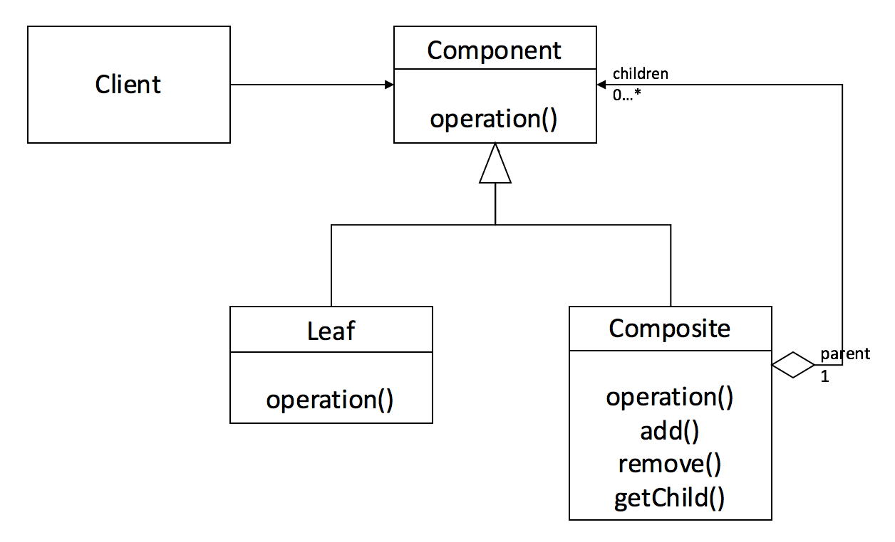

# Composite Pattern (복합체 패턴)

## 정의
- 복합체 패턴(Composite Pattern)은 복합 객체(Composite)와 단일 객체(Leaf)를 동일한 컴포넌트로 취급하여, 클라이언트에게 이 둘을 구분하지 않고 동일한 인터페이스를 사용하도록 하는 구조 패턴이다.
- 복합체 패턴은 전체-부분의 관계를 갖는 객체들 사이의 관계를 트리 계층 구조로 정의해야 할때 유용하다. 윈도우나 리눅스의 파일 시스템 구조를 떠올려보면 쉽게 이해할 수 있다.
- 폴더(디렉토리) 안에는 파일이 들어있을 수도 있고 파일을 담은 또 다른 폴더도 들어있을 수 있다. 이를 복합적으로 담을 수 있다해서 Composite 객체라고 불리운다.
- 반면 파일은 단일 객체 이기 때문에 이를 Leaf 객체라고 불리운다. 즉 Leaf는 자식이 없다.

<p align="center"></p>

- 복합체 패턴은 바로 이 폴더와 파일을 동일한 타입으로 취급하여 구현을 단순화시키는 것이 목적이다.
- 폴더 안에는 파일 뿐만 아니라 서브 폴더가 올수 있고 또 서브 폴더안에 서브 폴더가 오고.. 이런식으로 계층 구조를 구현하다 보면, 자칫 복잡해 질 수도 있는 복합 객체를 재귀 동작을 통해 하위 객체들에게 작업을 위임한다.
- 그러면 복합 객체와 단일 객체를 대상으로 똑같은 작업을 적용할 수 있어 단일/복합 객체를 구분할 필요가 거의 없어진다.

## 구조
<p align="center"></p>

- 🐳 __Component__ : Leaf와 Compsite를 묶는 공통적인 상위 인터페이스
- 🐳 __Composite__ : 복합 객체로서, Leaf 역할이나 Composite 역할을 넣어 관리하는 역할을 한다.  
  - 🍀 Component 구현체들을 내부 리스트로 관리한다
  - 🍀 add 와 remove 메소드는 내부 리스트에 단일 / 복합 객체를 저장
  - 🍀 Component 인터페이스의 구현 메서드인 operation은 복합 객체에서 호출되면 재귀 하여, 추가 단일 객체를 저장한 하위 복합 객체를 순회하게 된다.
- 🐳 __Leaf__: 단일 객체로서, 단순하게 내용물을 표시하는 역할을 한다.
  - 🍀 Component 인터페이스의 구현 메서드인 operation은 단일 객체에서 호출되면 적절한 값만 반환한다
- 🐳 __Client__ : 클라이언트는 Component를 참조하여 단일 / 복합 객체를 하나의 객체로서 다룬다.

- 복합체 패턴의 핵심은 Composite와 Leaf가 동시에 구현하는 operation() 인터페이스 추상 메서드를 정의하고, Composite 객체의 operation() 메서드는 자기 자신을 호출하는 재귀 형태로 구현하는 것이다.
- 왜냐하면 폴더 안에 폴더를 넣고, 그 안에 또 폴더를 넣고 파일을 넣는 트리 구조를 생각해보면, 재귀적으로 반복되는 형식이 나타나기 때문이다. 그래서 단일체와 복합체를 동일한 개체로 취급하여 처리하기 위해 재귀 함수 원리를 이용한다.

## 흐름
### 클래스 구성
```java
interface Component {
    void operation();
}
```
```java
class Leaf implements Component {
    @Override
    public void operation() {
        System.out.println(this + " 호출");
    }
}
```
```java
class Composite implements Component {
    // Leaf 와 Composite 객체 모두를 저장하여 관리하는 내부 리스트
    List<Component> components = new ArrayList<>();

    public void add(Component c) {
        components.add(c); // 리스트 추가
    }

    public void remove(Component c) {
        components.remove(c); // 리스트 삭제
    }

    @Override
    public void operation() {
        System.out.println(this + " 호출");
        
        // 내부 리스트를 순회하여, 단일 Leaf이면 값을 출력하고,
        // 또 다른 서브 복합 객체이면, 다시 그 내부를 순회하는 재귀 함수 동작이 된다.
        for (Component component : components) {
            component.operation(); // 자기 자신을 호출(재귀)
        }
    }
    
    public List<Component> getChild() {
        return components;
    }
}
```

### 클래스 흐름
```java
class Client {
    public static void main(String[] args) {
        // 1. 최상위 복합체 생성
        Composite composite1 = new Composite();

        // 2. 최상위 복합체에 저장할 Leaf와 또 다른 서브 복합체 생성
        Leaf leaf1 = new Leaf();
        Composite composite2 = new Composite();

        // 3. 최상위 복합체에 개체들을 등록
        composite1.add(leaf1);
        composite1.add(composite2);

        // 4. 서브 복합체에 저장할 Leaf 생성
        Leaf leaf2 = new Leaf();
        Leaf leaf3 = new Leaf();
        Leaf leaf4 = new Leaf();

        // 5. 서브 복합체에 개체들을 등록
        composite2.add(leaf2);
        composite2.add(leaf3);
        composite2.add(leaf4);

        // 6. 최상위 복합체의 모든 자식 노드들을 출력
        composite1.operation();
    }
}
```


## 특징
### 사용 시점
- 데이터를 다룰 때 계층적 트리 표현을 다루어야 할 때
- 복잡하고 난해한 단일 / 복합 객체 관계를 단순화하여 균일하게 처리하고 싶을 때
### 장점
- 단일체와 복합체를 동일하게 여기기 때문에 묶어서 연산하거나 관리할 때 편리하다.
- 다형성 재귀를 통해 복잡한 트리 구조를 보다 편리하게 구성할 수 있다. 
- 수평적, 수직적 모든 방향으로 객체를 확장할 수 있다.
- 새로운 Leaf 클래스를 추가하더라도 클라이언트는 추상화된 인터페이스만을 바라보기 때문에 개방 폐쇄 원칙(OCP)을 준수한다. (단일 부분의 확장이 용이)
 
### 단점
- 재귀 호출 특징 상 트리의 깊이(depth)가 깊어질수록 디버깅에 어려움이 생긴다.
- 설계가 지나치게 범용성을 갖기 때문에 새로운 요소를 추가할 때 복합 객체에서 구성 요소에 제약을 갖기 힘들다.
- 예를 들어, 계층형 구조에서 leaf 객체와 composite 객체들을 모두 동일한 인터페이스로 다루어야 하는데, 이 공통 인터페이스 설계가 까다로울 수 있다.
  - 복합 객체가 가지는 부분 객체의 종류를 제한할 필요가 있을 때
  - 수평적 방향으로만 확장이 가능하도록 Leaf를 제한하는 Composite를 만들때

## 예시
### 파일 디렉토리 시스템 구현
- 리눅스에서 ls 나 tree 명령어를 쓰면 파일들이 일괄적으로 출력되는데 이 기능을 비슷하게 컴포지트 패턴을 통해 구성해보고자 한다.

```java
// Component
interface Node {
    // 계층 트리 출력
    void print();
    void print(String str);

    // 파일/폴더 용량 얻기
    int getSize();
}
```
```java
// Composite
class Folder implements Node {
    private String name; // 폴더 이름

    private ArrayList<Node> list;

    public Folder(String name) {
        this.name = name;
        list = new ArrayList<>();
    }

    // 리스트에 폴더, 파일 추가
    public void add(Node node) {
        list.add(node);
    }

    // 공백 indent 표현 처리를 위한 print 메서드 오버로딩
    public void print() {
        this.print("");
    }

    public void print(String str) {
        int size = getSize(); // 폴더가 담고 있는 모든 파일에 대한 용량 합산

        System.out.println(str + "\uD83D\uDCC2" + name + " (" + size + "kb)");

        for (Node node : list) {
            // Folder 일 경우 재귀 동작
            node.print(str + "    "); // 인자로 공백문자를 할당하여 indent 처리
        }
    }

    // 각 파일의 용량(kb) 구하기
    public int getSize() {
        int sum = 0;
        for (Node node : list) {
            sum += node.getSize(); // print 로직과 똑같이 재귀 동작
        }
        return sum;
    }
}
```
```java
// Leaf
class File implements Node {
    private String name; // 파일 이름
    private int size; // 파일 사이즈

    public File(String name, int size) {
        this.name = name;
        this.size = size;
    }

    public void print() {
        this.print("");
    }

    public void print(String str) {
        System.out.println(str + "\uD83D\uDCDC" + name + " (" + size + "kb)");
    }
    
    public int getSize() {
        return size;
    }
}
```
```java
class Client {
    public static void main(String[] args) {
        Folder root = new Folder("root");

        File file1 = new File("file1", 10);
        Folder sub1 = new Folder("sub1");
        Folder sub2 = new Folder("sub2");

        root.add(sub1);
        root.add(file1);
        root.add(sub2);

        File file11 = new File("file11", 10);
        File file12 = new File("file12", 10);

        sub1.add(file11);
        sub1.add(file12);

        File file21 = new File("file21", 10);

        sub2.add(file21);

        // 전체 dir 출력
        root.print();
    }
}
```


